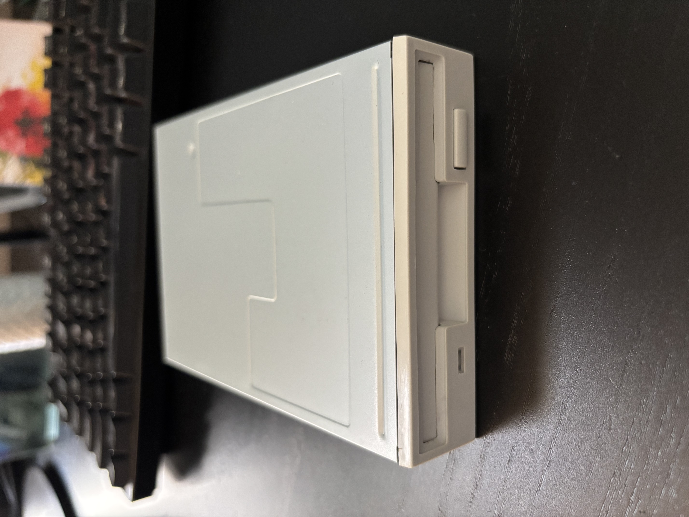
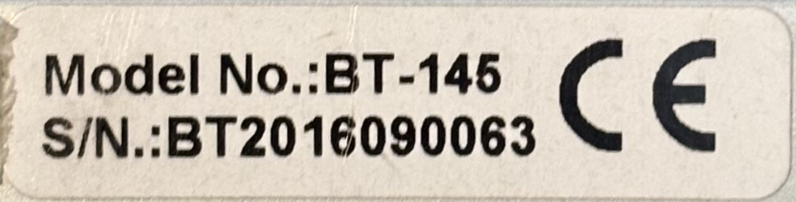

# Bytecc BT-145 3.5" 1.44MB Floppy Drive

1.44MB 3.5" floppy drive purchased in 2017 [from Amazon](https://www.amazon.com/Bytecc-BT-145-3-5-inch-Floppy-Drive/dp/B001GUY5HW). Appears to be a refurbished Sony drive (likely MPF-920) with a Sony CXA8061Q chip onboard.