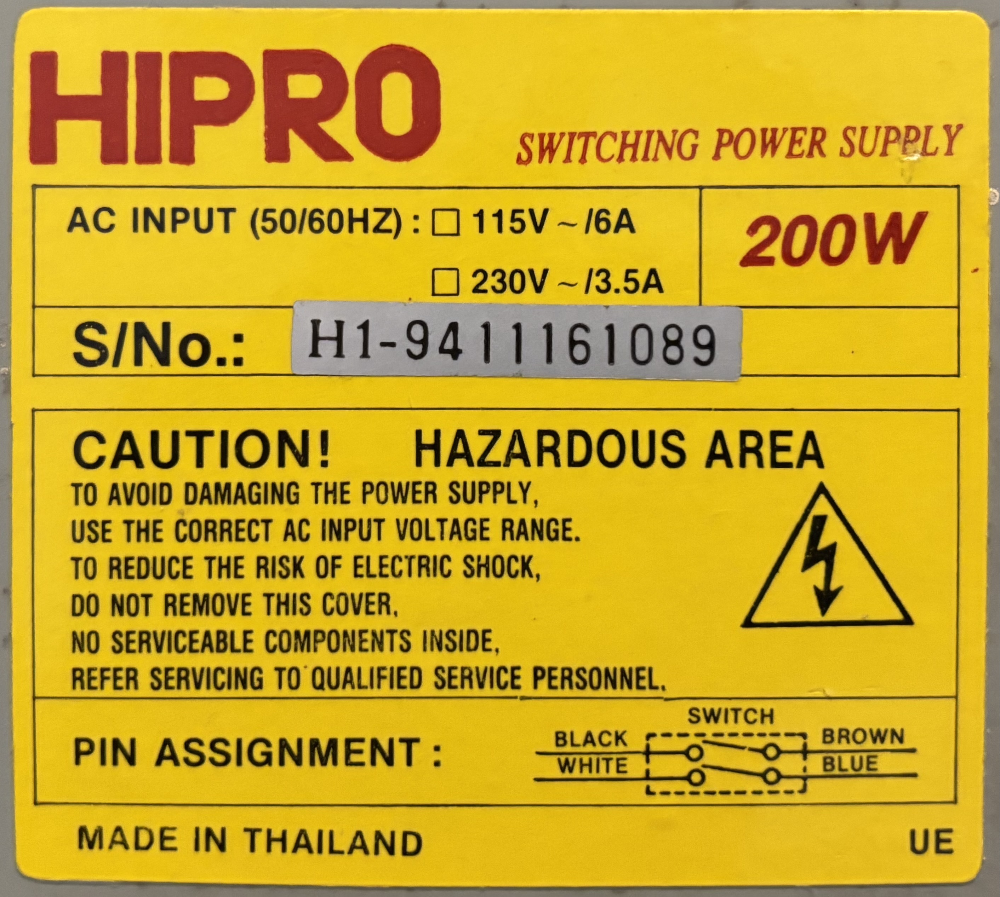

# Hipro 200W AT Power Supply

## Personal Notes

This power supply was made in Thailand, likely in 1994 based on the first two digits of the serial number. It came pre-installed in the [Baby AT Desktop Case](../Case/README.md) that I bought in 1995.

I oiled the fan bearings in 2025 since it was starting to get noisy. Now it is very quiet, almost rivaling a Noctua. Otherwise, the power supply has not been modified, capacitors look good, and voltages are within spec.