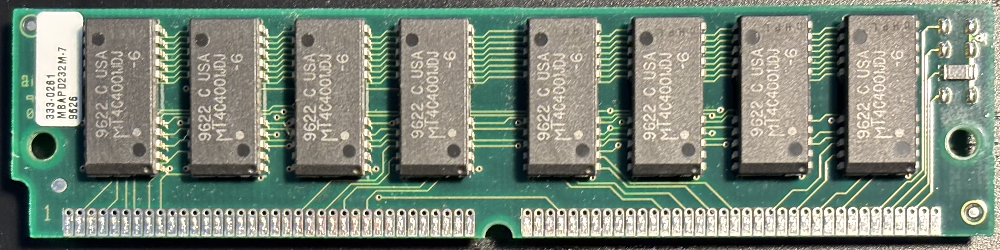
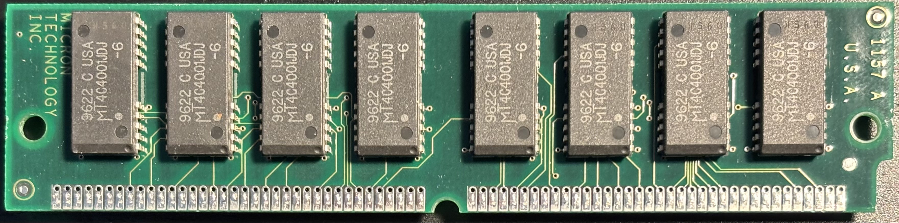

# Micron MBAPD232M-7 8MB FPM SIMM (2 pcs)

## Personal Notes

The SIMMs were made in the 22nd week of 1996 in the USA.  They came out of a Power Macintosh 5460/100 that I bought in August 2024, upgraded to 64MB, and later got rid of.

## Documentation

- [MT4C4001JS Datasheet](MT4C4001JS.pdf)