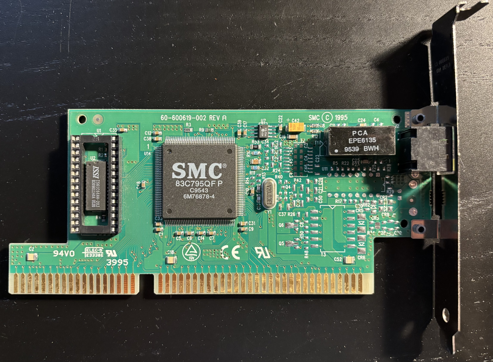
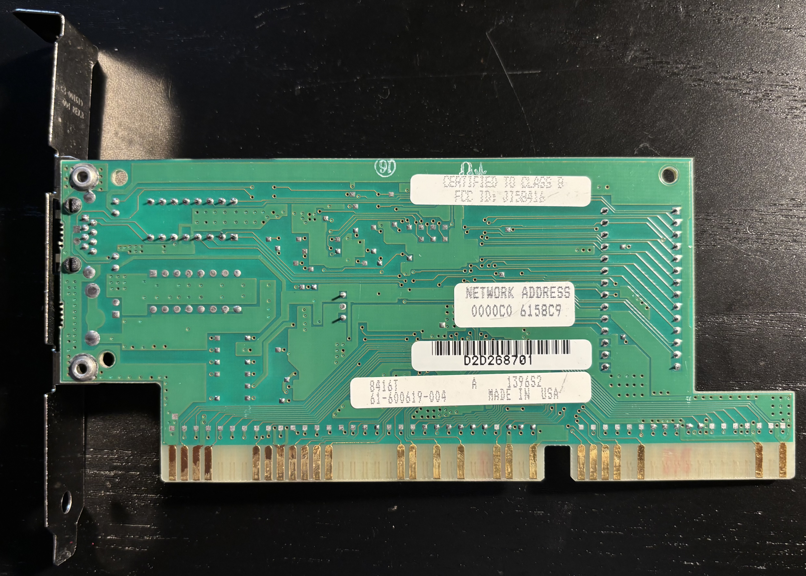

# SMC EtherEZ 8416T ISA 10Base-T Ethernet Adapter

## Personal Notes

My board was made in the USA after the 43rd week of 1995.  I bought it in January 2005 from the [mkop8907](https://www.ebay.com/usr/mkop8907) store on eBay.  

## Documentation

- [SMC EtherEZ Brochure](EtherEZ-brochure.pdf)
- [SMC EtherEZ Manual](EtherEZ-manual.pdf)
- [SMC 83C795 Datasheet](83C795.pdf)

## Drivers

- [SMC EtherEZ 8416T Drivers](https://theretroweb.com/expansioncards/s/smsc-smc-etherez-smc8416t#driver) on The Retro Web

The packet drivers work well with [mTCP](https://www.brutman.com/mTCP/) in DOS.  I normally run the mTCP FTP server on the 486 and then push/pull files using an FTP client on my modern PC. I haven't tried to get IPX or NetBEUI running on it yet.