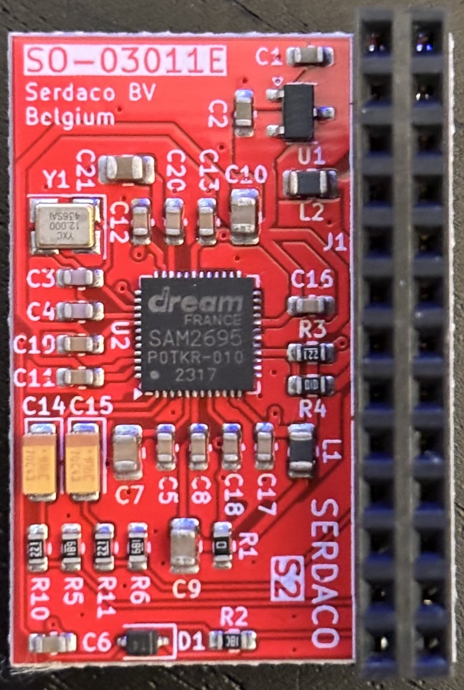
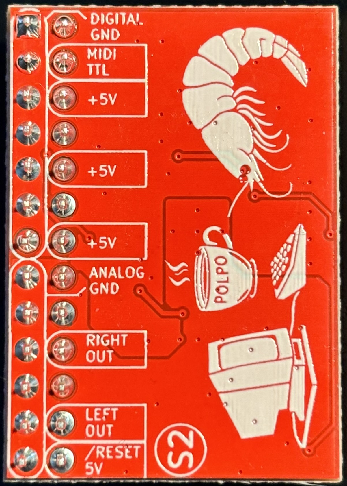

# Serdaco DreamBlaster S2 General MIDI Daughterboard

| Front                | Back               |
|----------------------|--------------------|
|  |  |

From the [DreamBlaster S2](https://serdaco.com/products/wavetable-boards/dreamblaster-s2/) website:

>DreamBlaster S2 is a low-cost Waveblaster compatible synth module based on the SAM2695 chip, perfectly suited for retro-gaming, music production and audio projects.
>
>DreamBlaster S2's unique capabilities combine wavetable and FM synthesis for a high end retro experience.

## Personal Notes

The SAM2695 chip on my board was made on the 17th week of 2023. I bought my S2 from [Serdashop](https://www.serdashop.com/waveblaster) in March 2025 and installed it on my [Sound Blaster 16](../SoundBlaster-CT2230/README.md).

## Documentation

- [SAM2695 Datasheet](SAM2695.pdf)

## Further Information

- [Serdaco DreamBlaster S2 Website](https://serdaco.com/products/wavetable-boards/dreamblaster-s2/)
- [Phil's Computer Lab Review Video](https://www.youtube.com/watch?v=3OhVLt6d5PY)
- [DreamBlaster S2 Review on Vogons](https://www.vogons.org/viewtopic.php?t=56166&p=616159)