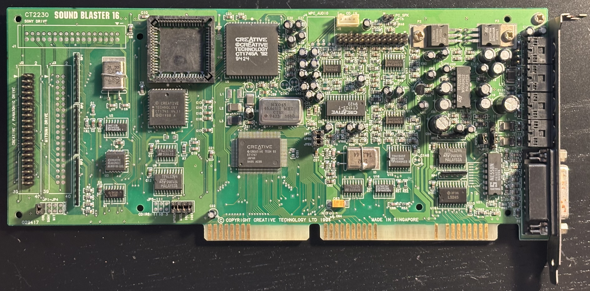
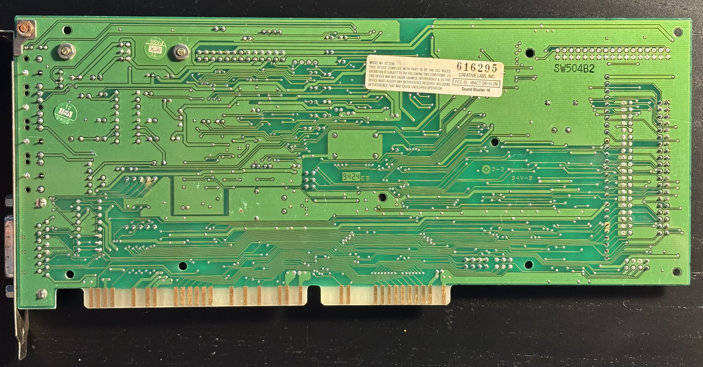

# Sound Blaster 16 (CT2230)

From [DOS Days](https://dosdays.co.uk/topics/Manufacturers/creative/ct2230.php):

>Kicking off the 2nd generation of Sound Blaster 16 cards was the CT2230, arriving in late 1994. These came with an integrated Yamaha FM synthesizer in a new ASIC, the CT1747. Because it was actual Yamaha hardware within, it got the "OPL" logo stamped on it.

# Personal Notes

My board was made in Singapore on the 24th week of 1994. I bought it in April 2025 from the [Wyoming Seller](https://www.ebay.com/str/wyomingseller) eBay shop. I had various issues with the Yamaha OPL3-SAx and ESS AudioDrive boards in my 486, and I wanted a Sound Blaster 16 model with a genuine Yamaha OPL3 in my collection. I have installed a [Dream Blaster S2](../Serdaco-DreamBlaster-S2/README.md) on its Wave Blaster header.

I had a Sound Blaster 16 (1st generation) in my Dell 486 system in 1993, until I replaced it with an AWE32.

## Documentation

- [MTL Jumper Manual](CT2230-jumpers.pdf) from The Retro Web

## Drivers

I have found these to be the best source for drivers:

- [Sound Blaster 16 Install CD](https://www.vogonsdrivers.com/getfile.php?fileid=800&menustate=0) on vogonsdrivers.com: contains the full set of drivers and software for both Windows 95 and DOS/Windows 3.1 as well as Sample MIDI and WAV files.
- [Sound Blaster 16 Drivers](https://www.philscomputerlab.com/ct1740.html) on philscomputerlab.com: sbbasic.exe contains updated DOS/Windows 3.1 drivers from Creative's BBS and Support Site, but they don't include the full set of applications on the Install CD.

Normally, I use the Install CD. The ones in sbbasic.exe may be newer but the ones from the CD work fine and they still don't require TSR drivers like older drivers do.

## Further Information

- [Sound Blaster 16](https://support.creative.com/Products/ProductDetails.aspx?prodID=1842&prodName=Sound%20Blaster%2016) on Creative Worldwide Support
- [Sound Blaster 16 CT2230](http://dosdays.co.uk/topics/Manufacturers/creative/ct2230.php) on DOS Days
- [Sound Blaster 16 CT2230](https://theretroweb.com/expansioncards/s/creative-sound-blaster-16-ct2230) on the Retro Web