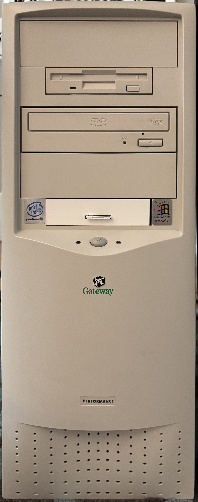
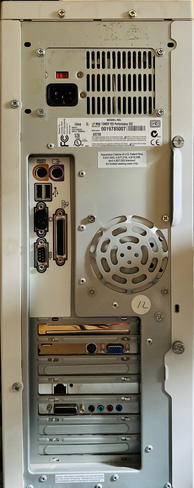

# Gateway Performance 933 (Pentium III 933MHz)

| CPU              | Motherboard   | RAM         | Video        | Sound               | Ethernet  | Storage | Floppy      | DVD-ROM |
|------------------|---------------|-------------|--------------|---------------------|-----------|---------|-------------|---------|
| Pentium 3 933MHz | Intel D815EEA | 384MB PC133 | GeForce 3 AGP| Sound Blaster Live! | 100Base-T | 64GB SD | 3.5" 1.44MB | 10-40X  |

| Front                     | Rear                    |
|---------------------------|-------------------------|
|  |  |

## Original Parts

- [Astec ATX202-3545 200W ATX Power Supply](../../parts/power/Astec-ATX202-3545/README.md)
- [Intel D815EEA Socket 370 Motherboard](../../parts/motherboard/Intel-D815EEA/README.md)
- [Intel Pentium III 933MHz Socket 370 CPU](../../parts/cpu/Intel-Pentium-III-933/README.md)
- [Micron MT8LSDT1664AG 128MB PC133 SDRAM](../../parts/memory/Micron-128MB-PC133-SDRAM/README.md) (3 pcs)
- [Nvidia Geforce 3 Graphics Card](../../parts/video/Nvidia-Geforce3/README.md)
- [Sound Blaster Live! 5.1 CT3840 Sound Card](../../parts/sound/SoundBlaster-Live-CT4830/README.md)
- [Encore ENL832-TX-VA 10/100Base-T PCI Ethernet Adapter](../../parts/network/Encore-ENL832-TX-VA/README.md)
- [Panasonic JU-256A216P 3.5" 1.44MB Floppy Drive](../../parts/storage/Panasonic-JU-256A216P/README.md)
- [Pioneer DVD-115GA 16X-40X IDE DVD-ROM Drive](../../parts/storage/Pioneer-DVD-115GA/README.md)

## Added Parts

- [SD35VC0 FC1307A-based SD to IDE Adapter](../../parts/storage/SD35VC0-SD-to-IDE/README.md)

## Removed Parts

- [IBM Deskstar IC35L060AVE407-0 60GB IDE Hard Drive](../../parts/storage/IBM-Deskstar-60GB/README.md)
- [Iomega Z250ATAPI 250MB IDE Zip Drive](../../parts/storage/Iomega-Z250ATAPI/README.md)
- [GVC SF-1156IV/R9A 56K PCI Modem](../../parts/network/GVC-SF-1156IV-R9A/README.md)

## Documentation

- [Gateway Ad from the August 2000 Issue of PC World](gateway-ad.pdf)

## Personal Notes

This system was made on August 7, 2000. I bought it in September 2024 from the [AZ Warehouse](https://www.ebay.com/str/ifixitusawarehouse) store on eBay. This is my first time owning a Pentium III system, since I upgraded directly from my K6 to a Pentium 4 in 2001.  My motivation for buying it was that after I built my [K6-2 with Voodoo3](../Juniper-Valley-K6/README.md), I downloaded a bunch of Glide games from GOG.com, only to realize that the K6 wasn't *quite* up to the task of playing some of them, so I got this system to play them on.
