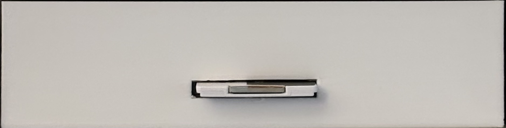
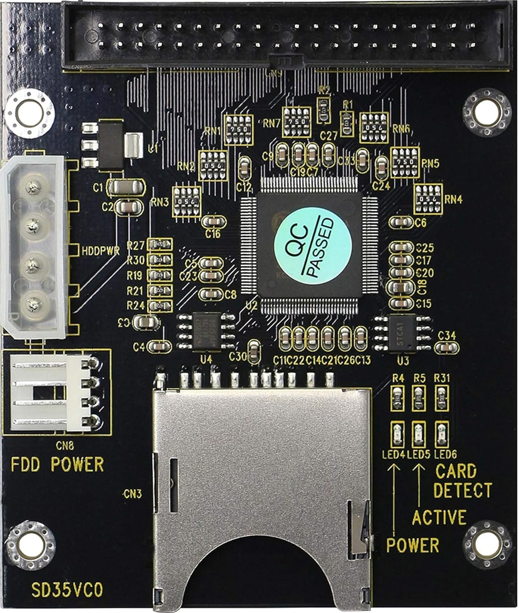

# SD35VC0 FC1307A-based SD to IDE Adapter

## Documentation

- [FC1307A Datasheet](FC1307A.pdf) (from [BitSavers](http://www.bitsavers.org/components/ktc/FC1307/))

## Further Information

- [Dr. Gough's Techzone Review](https://goughlui.com/2019/02/03/tested-generic-sintechi-fc1307a-based-sd-to-ide-adapter-sd35vc0/)
- [Amazon Product Page](https://www.amazon.com/dp/B08SK28S2Y?ref_=ppx_hzsearch_conn_dt_b_fed_asin_title_4)
- [3.5" Drive Bay Adapter](https://www.ebay.com/itm/303551644199?var=602858353798)