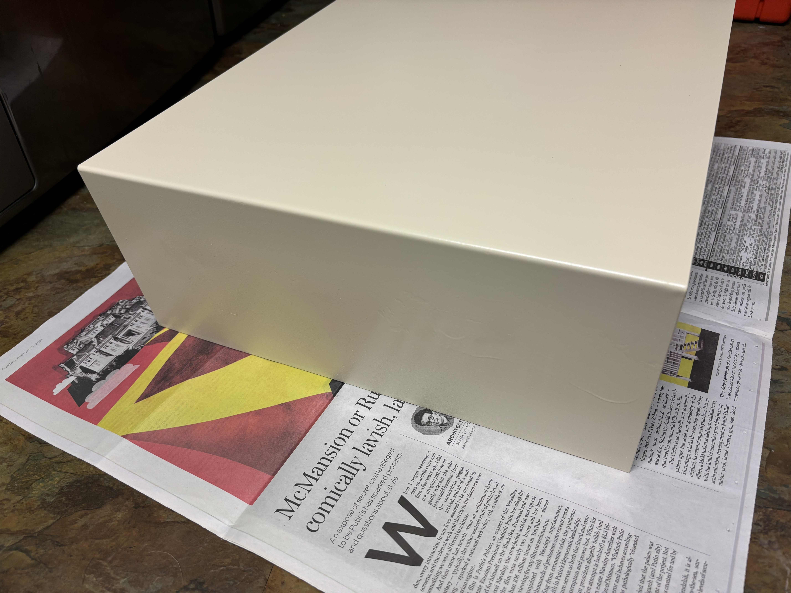

# Juniper Valley AMD K6-2 550MHz with Voodoo3

## Backstory

In college around 1998, I had a very similar system with a Voodoo3 and K6 Processor.  To the best of my recollection, the K6 was 300MHz and Voodoo3 was a 2000.  The sound was a Sound Blaster AWE32 that I had transplanted from a 486 and a Pentium before this. 

In 2024, I attempted to rebuild the system as closely as possible, with a few upgrades:
- Bought a Juniper Valley K6-2 350MHz desktop on eBay
- Hammered out the dents and spray painted the badly dented and scuffed case.
- Replaced the noisy Socket 7 CPU cooler with a new StarTech one
- Upgraded the Trident 3DImage 9850 with an AGP Voodoo3 3000 and added a cooling fan
- Upgraded the CPU from a K6-2 350MHz to a K6-2 533MHz and overclocked to 550MHz
- Upgraded RAM from 64GB to 128GB PC100 SDRAM
- Added a Sound Blaster 32 PnP CT3600 
- Added a CF to IDE adapter with a 32GB CF card (the largest disk supported by the BIOS)
- Added a 2 port USB bracket to connect to the header on the motherboard
- Kept the motherboard, NIC, floppy drive, and CD-RW as is.
- Installed Windows 98SE

## Specs

- [AMD K6-2 533MHz](https://web.archive.org/web/20191021001623/http://www.cpu-world.com/CPUs/K6-2/AMD-K6-2%20533%20-%20AMD-K6-2-533AFX.html) CPU overclocked to 550MHz
- [FIC VA-503+](https://theretroweb.com/motherboards/s/fic-va-503) Motherboard
- [3dfx Voodoo3](https://theretroweb.com/expansioncards/s/3dfx-voodoo-3-3000) 3000 AGP Video Card
- [SoundBlaster 32 PNP CT3600](https://theretroweb.com/expansioncards/s/creative-sound-blaster-32-ide-pnp-ct3600) Sound Card
- [SMC EtherPower II 9432TX](http://vogonsdrivers.com/getfile.php?fileid=1882&menustate=0) 10/100Base-T Network Card
- 128MB PC-100 SDRAM (1 DIMM)
- [StarTech 3.5" Bay CF to IDE Adapter](https://www.startech.com/en-eu/hdd/35baycf2ide)
- [32GB SanDisk Extreme Card](https://shop.sandisk.com/products/memory-cards/cfast-cfexpress-compactflash/sandisk-extreme-compactflash?sku=SDCFXSB-032G-G46)
- Lite-On LTR-52327S 52x CD-RW Drive
- 3.5" 1.44MB Floppy Drive
- Baby AT Desktop Case
- Enlight EN-8207801 200W Power Supply
- Ports
  - AT Keyboard
  - PS/2 Mouse
  - 2x Serial (1 DB-9, 1 DB-25)
  - 1x Parallel
  - 2x USB 1.1

## Spare Parts

- AMD K6-2 350MHz
- 64MB PC100 SDRAM (2 32MB DIMMs)
- [Trident 3DImage 9850](https://vintage3d.org/trident2.php) AGP Video Card

## More Photos

### 3dfx Voodoo3 3000

### Sound Blaster 32 PnP CT3600

### SMC EtherPower II 10/100 3432TX NIC

### Misc

