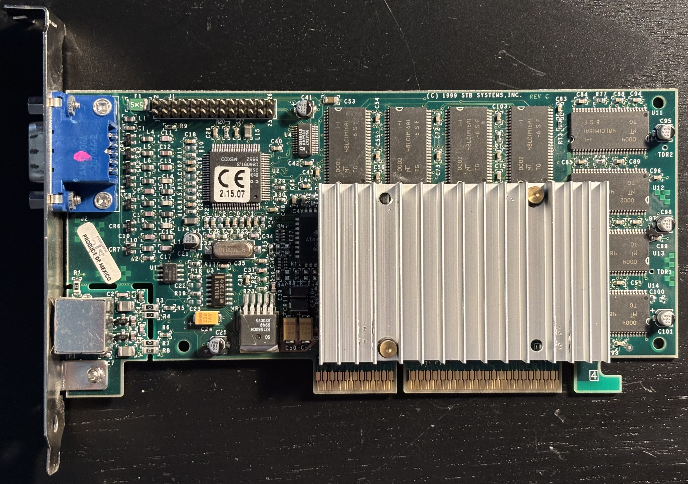
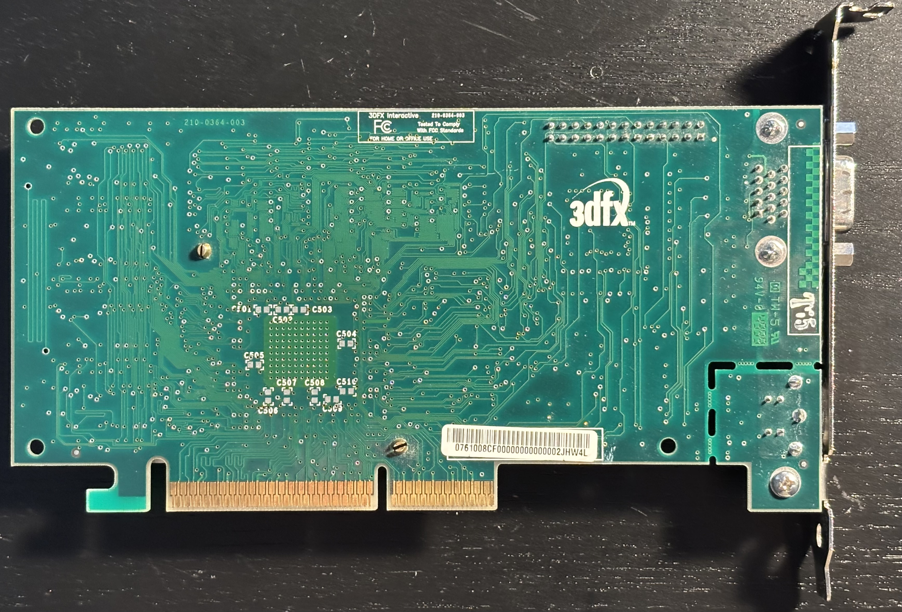
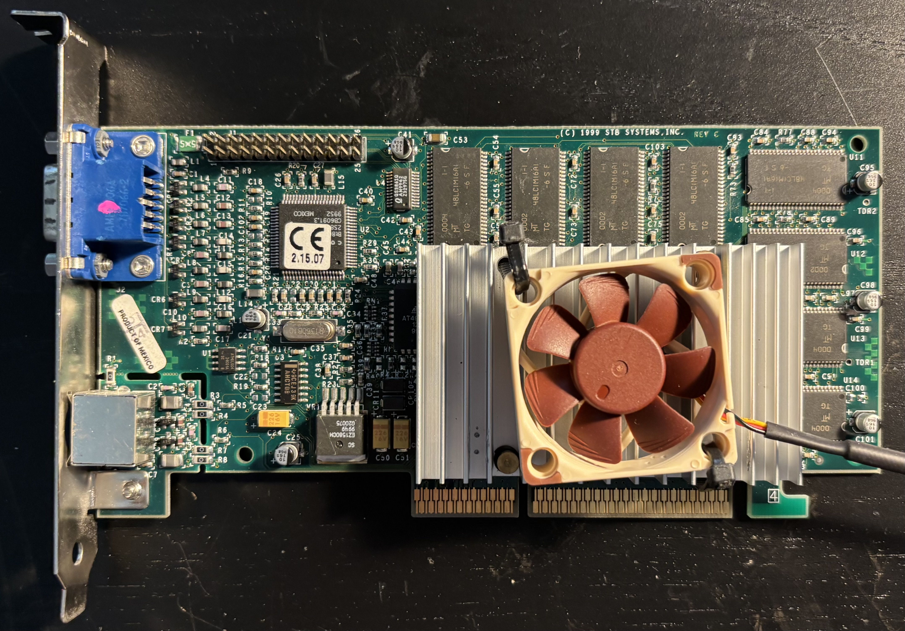

# 3dfx Voodoo3 3000

The Voodoo3 was 3dfx's second integrated 2D/3D chip, following the Voodoo Banshee. It can be thought of as a higher-clocked Voodoo2 with integrated 2D graphics, since restored the second texture mapping unit from the Voodoo2 that had been removed in the Voodoo Banshee. The 2000 and 3000 models differ only in clock speed. Both have 16MB of video RAM. The cards came in PCI and AGP versions. The AGP version does not use any special AGP features, making it a good match for chipsets with buggy AGP implementations.

## Personal Notes

My board was made in Mexico, 49th week of 1999. I bought it in September 2024 from [SKC-STORE](https://www.ebay.com/str/skccomputers) on eBay.

To help with cooling, I strapped a [Noctua NF-A4x10 FLX](https://noctua.at/en/nf-a4x10-flx) onto the heatsink with zip ties.

## Documentation

Documents courtesy of [BitSavers](http://www.bitsavers.org/components/3dfx/):

- [Voodoo3 2000/3000 Reviewer's Guide](reviewers_guide.pdf)
- [Voodoo3 Data Book revision 1.9](databoook.pdf)
- [Voodoo3 Spec revision 1.0](specification.pdf)
- [Voodoo3 Programming Guide](programming_guide.pdf)
- [Glide 3.0 Programming Guide](glide3_guide.pdf)
- [Glide 3.0 Reference Manual](glide3_reference.pdf)

## Drivers

The last official drivers, version 1.07.00 for Windows 98 and 1.03.00 for Windows 2000 are available from the following sites:

- [Drivers for 3dfx Voodoo3](https://www.philscomputerlab.com/drivers-for-voodoo-3.html) on philscomputerlab.com
- [3dfx Driver Downloads](https://soggi.org/drivers/3dfx-voodoo.htm) on soggi.org

## Further Information

- [3dfx Voodoo3 3000](https://dosdays.co.uk/topics/Manufacturers/3dfx/3dfx_voodoo3_3000.php) on DOS Days
- [3dfx Voodoo3 3000](https://theretroweb.com/expansioncards/s/3dfx-voodoo-3-3000) on The Retro Web
- [3dfx Voodoo3 Review](https://www.anandtech.com/show/272) on Anandtech
- [Preview of 3dfx Voodoo3](https://www.tomshardware.com/reviews/preview-3dfx-voodoo3,100.html) on Tom's Hardware
- [Voodoo3 Retro Review](https://www.philscomputerlab.com/3dfx-voodoo-3-retro-review.html) on philscomputerlab.com