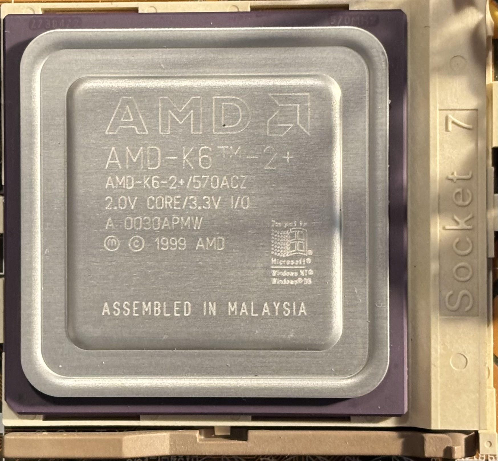

# AMD K6-2+/570ACZ CPU

| Core Freq | Bus Freq   | Multiplier | L1 Cache  | L2 Cache | Core Voltage | I/O Voltage | Package  | Socket  | Process |
|-----------|------------|------------|-----------|----------|--------------|-------------|----------|---------|---------|
| 570 MHz   | 95 MHz     | 6          | 32KB/32KB | 256KB    | 2.0V         | 3.3V        | CPGA-168 | Super 7 | 180 nm  |

## Personal Notes

This CPU was made in Malaysia during the 30th week of 2000. I bought it in March 2025 from the [magicmanred81](https://www.ebay.com/usr/magicmanred81) store on eBay.  The seller modified it to enable the full 256KB L2 cache and tested it to reliably overclock to 633MHz. I have it clocked at 550MHz by default (100MHz fsb/5.5x multiplier), and it can be overclocked to 600MHz in software using Setmul or CTU.

## Listing Details

The eBay listing had a lot of helpful information about using and overclocking the CPU, which I have duplicated here.

### What you get in the box:
1 x AMD K6 II+ 570mhz ACZ 128kb L2 Cache 2.0v CPU - Modified to 256kb L2 Cache (K6 III+ Spec)

### Modification done to CPU:

256kb total cache enabled to match all specs of a K6 III+

Motherboards will recognize this CPU as a K6 III+ or K6 III depending on Motherboard & BIOS

All chips were repasted with Noctua NT-H1 thermal paste and the CPU lid was re-sealed with epoxy.

The difference between a K6 II+ and K6 III+ is the amount of cache (128/256)

### Testing:

All CPU's tested to 633mhz with CPU stress testing and many game titles to check for consistency in performance.

All Cache tested while OC'd to 633mhz as well to check for consistency in throughput.

No need to spend time/money on soldering tools & play the lotto on modding one yourself!

### What this CPU can do:

It can run exact speeds & volt of a K6 3+ 550 ACR chip (100FSB with 5.5 Multi @ 2.0v) all day long stable.

It can easily out-clock & out-perform the 550 ACR since it reaches higher Mhz with the same Volt.

It is a "Z" chip. Not an "R" chip. (See below)

### Little known facts:

ACZ chips handle higher heat than ACR, which means they will overclock better.
The "Z" indicates a Case Temperature rating of 85c.

Whereas the "R" indicates a Case Temperature rating of only 70c.
See pic for CPU code chart.

You can now see why these modded ACZ chips are highly sought after since they can reach 570mhz with only 2v.
Whereas the ACR only does 550mhz with 2v.

This is why my modded CPU's can regularly hit 600mhz to 633mhz without a hitch at only 2.1v to 2.4v depending on your cooler/motherboard.

### Who this CPU is for:

Are you a retro enthusiast? Do you have a Super Socket 7 system that you are looking to MAX out the CPU performance in?

THIS IS IT!

### Testing platform:

All testing to CPU was done with the following equipment:

- **MB:** Gigabyte GA-5AX rev 5.2 or ASUS P5A rev 1.04
- **RAM:** 1 x 256mb Crucial/Micron PC133 CL2 stick
- **PSU:** Antec True 430w
- **GPU:** 3dfx Voodoo3 3500 AGP or Diamond Monster Fusion Voodoo Banshee AGP
- **SOUND:** Creative Labs Sound Blaster AWE 64 Gold ISA w/ CT1930 Memory Upgrade Module
- **HDD:** Maxtor Atlas II 15,000rpm 73gb Ultra320 SCSI on an Adaptec 2940U2W SCSI PCI card
- **ODD:** Plextor 716A IDE CD/DVD R/W
- **FDD:** Epson SD800 Dual Floppy drive 3.5" & 5.25"
- **TAPE:** Colorado T3000 Tape Drive
- **IOMEGA:** 250mb IDE Zip Drive & 2gb SCSI Jaz Drive
- **LAN:** 3Com 3C905C PCI 10/100Mbit
- **MODEM:** 3Com US Robotics 0613 ISA 56k Modem

#### OS:

System Commander 8 Multi-Boot with the following partitions for OS:

- Partition 1 (FAT) - DOS 6.22, Windows 3.11, Windows 95 Plus!
- Partition 2 (FAT32) - Windows 98 SE Plus!
- Partition 3 (FAT32) - Windows ME
- Partition 4 (NTFS) - Windows 2000 Pro SP4

### Common Overclock Settings for this CPU:

I've found the sweet spot to be the following on a Gigabyte GA-5AX rev 5.2:

- 600Mhz (100fsb x 6 @ 2.1v) Easily achievable if you only have 100mhz RAM.
- 600Mhz (*120fsb x 5 @ 2.1v) For high memory bandwidth. Ram & FSB will run at 120mhz.
- 605Mhz (110fsb x 5.5 @ 2.1v)
- 625Mhz (*125fsb x 5 @ 2.2v-2.3v) High CPU & RAM performance. Hard to get 125mhz fsb stable on most mb's.
- 630Mhz (105fsb x 6 @ ~2.3v) May be able to push your 100Mhz ram to 105 Mhz to get this 630Mhz clock.
- 633Mhz (115fsb x 5.5 @ 2.2v-2.3v) **Most popular setup.** Ram & FSB will run at 115mhz.
- 650Mhz (*130fsb x 5 @ 2.4v) This is hard to get stable. Ram & motherboard must really want to cooperate.
- 660Mhz (110fsb x 6 @ 2.4v+) This is godlike overclocking that may need serious cooling and a unicorn mb.
- 660Mhz (*120fsb x 5.5 @ 2.4v+) More ideal than the above, but harder to achieve because of the fsb bump.

*Note: Disabling Motherboard cache may be necessary for anything over 110-115fsb.

This is because onboard cache typically cannot handle high FSB.

 

Enabling it will therefore limit your fsb OC.

Disabling this allows for 120+ fsb settings depending on your MB.

Your mileage may vary on the highest FSB you can hit based on your board.

I've found the 633mhz setting to be the sweet spot in performance all around.

You get a great RAM bandwidth boost, and the highest clock.

Enabling or Disabling onboard cache had no impact on performance since the CPU cache is best.

### Can't find a 6x multiplier setting on your motherboard?

If your motherboard doesn't have a setting for 6x multi, use the 2x multi since those are coded to run 6x on the K6 2+ and 3+ chips. You also may want to make sure you're bios is updated to the latest version.

### Can't run a 6x multi? Want a command-line tool to do so in DOS?

Lookup SETMUL.EXE

### Need an on-the-fly in-Windows CPU Multiplier adjuster + more?

Look up CTU.EXE

### Need an on-the-fly in-Windows Memory timings adjuster because your BIOS options are limited?

Look up WPCREDIT.EXE

This setmul.exe tool is VERY useful for running MS-DOS games that require cache disabled and lower clock speeds to run at proper frame rates. This will eliminate the need to crack open your case and move jumpers around constantly to adjust clock speeds, and the need to go into bios to disable caches.

### Case Badge Option:

Geekenspiel's website has stickers/badges for these that him and I worked on. They look great!
Check them out! They'll spice up your retro PC's case nicely!

Grab one before they run out!
I am selling these on the marketplace/locally as well!