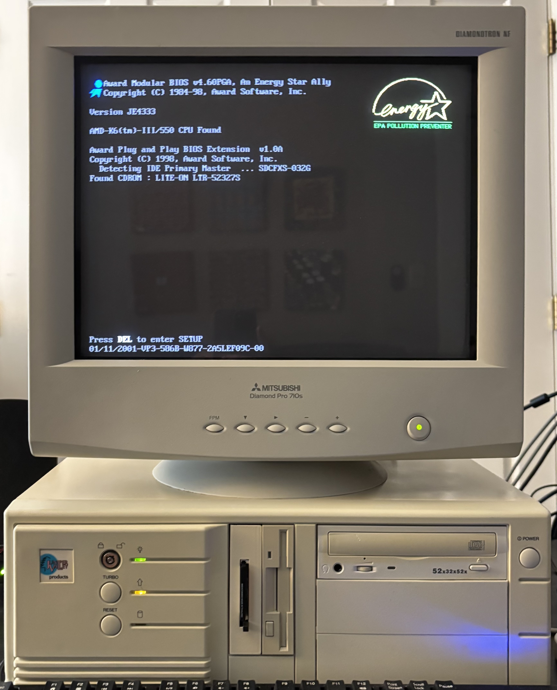
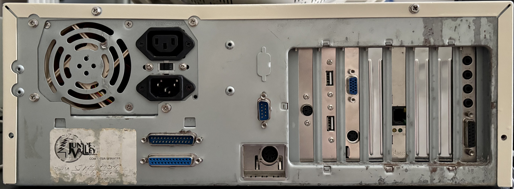

# Juniper Valley Products K6

| CPU              | Motherboard | RAM         | Video            | Sound            | Ethernet     | Storage | Floppy      | CD-RW    |
|------------------|-------------|-------------|------------------|------------------|--------------|---------|-------------|-----------|
| AMD K6-2+ 570ACZ | FIC VA-503+ | 128MB PC100 | Voodoo3 3000 AGP | Sound Blaster 32 | 100Base-T    | 32GB CF | 3.5" 1.44MB | 52/32/52X |

## Personal Notes

I had a very similar system in college around 1998, which I bought with the money I made programming at my first summer job. To the best of my recollection, it had a 300MHz K6 and a Voodoo3 2000. The sound card was an AWE32 (original non-PnP model) that I had used in my 486DX2-66 and Pentium-120 systems before this. I did much of my computer science coursework on this system, not to mention playing early 3D games like Quake and Unreal.

In August 2024, nostalgia got the better of me and I bought this beat-up looking K6 350MHz system from the [SUM Computers](https://www.ebay.com/str/sumcomputers) eBay store. I hammered out the dents and repainted the case, added the missing Voodoo3 and AWE32, and upgraded the CPU and memory to its current specs.

At first glance, I assumed Juniper Valley Products was just another anonymous seller of beige boxes, but it turns out this computer has a checkered past. Some internet searching led me to a [June 2003 Performance Audit of Correctional Industries](https://leg.colorado.gov/sites/default/files/documents/audits/1478_surpprop_perf_fy_04.pdf), which states that "Correctional Industries operates under the trade name Juniper Valley Products;" and "Staffed by inmates, Computer Services refurbishes surplus computer equipment and sells it to nonprofit organizations and the general public."

## Original Components

- [Baby AT Desktop Case](Case/README.md)
- [Enlight EN-8207801 200W Power Supply](Enlight-EN-8207801/README.md)
- [FIC-VA-503+ REV 1.2A Motherboard](FIC-VA-503+/README.md)
- [SMC EtherPower II 9432TX 10/100Base-T Network Card](SMC-9432TX/README.md)
- [TEAC FD-235HF 3.5" 1.44MB Floppy Drive](Teac-FD-235HF-A291/README.md)
- [Lite-On LTR-52327S 52x/32x/52x CD-RW Drive](LiteOn-LTR-52327S/README.md)

## Added Components

- [AMD K6-2+/570ACZ 570MHz Socket 7 CPU with 256KB L2 cache](AMD-K6-2+-570ACZ/README.md)
- [Hyundai 128MB PC100 SDRAM](Hyundai-128MB-PC100-SDRAM/README.md)
- [3dfx Voodoo3 3000 AGP 3D Video Card](3dfx-Voodoo3-3000/README.md)
- [Sound Blaster 32 PnP (CT3600) Sound Card](SoundBlaster-32-CT3600/README.md)
- [StarTech 3.5" Drive Bay IDE to CF Adapter](StarTech-35BAYCF2IDE/README.md)
- [32GB SanDisk Extreme Card](https://shop.sandisk.com/products/memory-cards/cfast-cfexpress-compactflash/sandisk-extreme-compactflash?sku=SDCFXSB-032G-G46)

## Removed Components

- [AMD K6-2/350AFR 350MHz Socket 7 CPU](../../parts/cpu/AMD-K6-2-350AFR/README.md)
- 64MB SDRAM (2 unmatched 32MB DIMMs):
  - [Samsung 32MB PC100 SDRAM](../../parts/memory/Samsung-32MB-PC100-SDRAM/README.md)
  - [TI 32MB PC100 SDRAM](../../parts/memory/TI-32MB-PC100-SDRAM/README.md)
- [Trident 3DImage 9850 AGP Video Card](../../parts/video/Trident-3DImage9750/README.md)