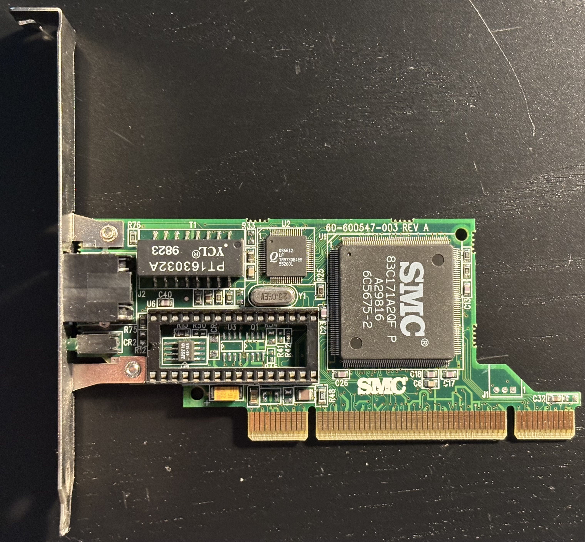
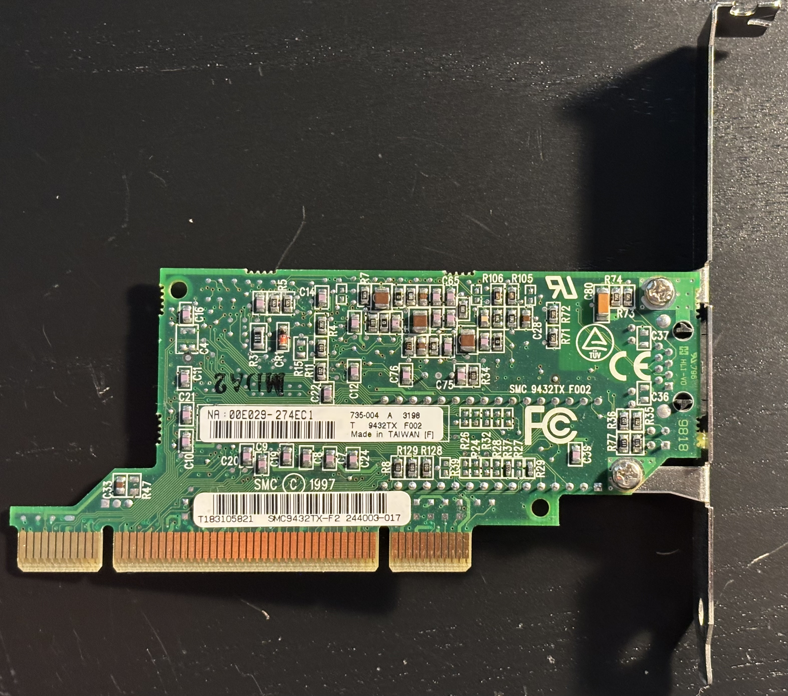

# SMC EtherPower II 10/100 (9432TX) PCI Ethernet Card

The 9432TX is a 10/100base-T PCI Ethernet adapter based on the SMC 83C171A2QF chip.

## Personal Notes

My board was made in Taiwan during the 31st week of 1998. It came in the [Juniper Valley K6](../README.md) system it's still installed in.

## Documentation

- [EtherPower II 10/100 User's Guide](manual.pdf)
- [SMSC LAN83C171 Datasheet](83c171.pdf)

## Drivers

- [SMC EtherPower II 10/100 PCI - SMC9432TX drivers](https://vogonsdrivers.com/getfile.php?fileid=1882&menustate=46,0) (vogonsdrivers.com)