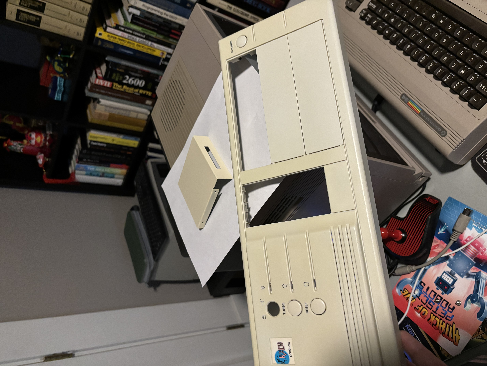

# StarTech 3.5in Drive Bay IDE to CF Adapter (35BAYCF2IDE)

From the [StarTech Website](https://www.startech.com/en-eu/hdd/35baycf2ide):

>This Compact Flash IDE adapter is a perfect solution for accessing CompactFlash (CF I, CF II) and IBM >Micro Drive media, allowing you to access the flash/micro drive media as if it were an IDE hard drive.
>
>The CF/IDE adapter can be installed in the computer case through simple mounting in an available 3.5in >drive bay, for connection to the computer IDE bus through either a 40 or 44-pin connection.
>
>Designed and constructed to provide a reliable media card platform, the CF IDE adapter is backed by >StarTech.com's 2-year warranty.

## Personal Notes

The 3.5" bay bracket was black originally and I spray-painted it beige to match the case.

## Documentation

- [Manual](35BAYCF2xxx.pdf)
- [Datasheet](35baycf2ide_datasheet.pdf)