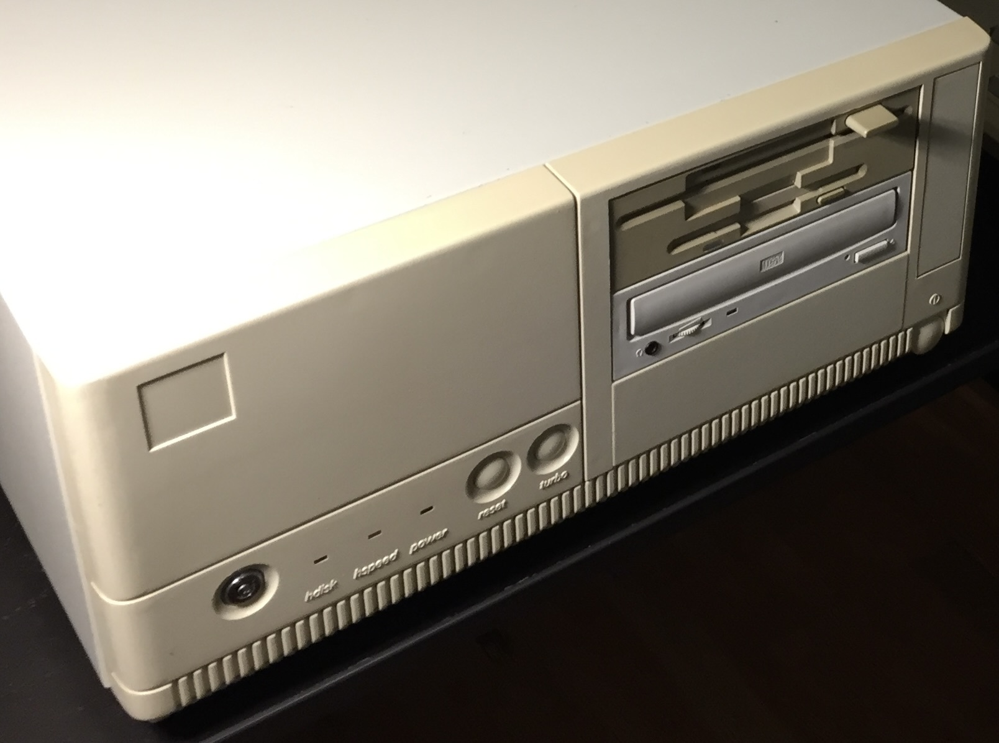

# Baby AT Desktop Case

Baby AT desktop case with 3 external 5.25" bays, 1 external 3.5" bay, and 1 internal 3.5" bay.

## Personal Notes

I bought this case in 1995 from my high school's science teacher and IT guy, Mr. Granger, who also owned [Naccom Network Services](https://web.archive.org/web/20020609182758/http://www.naccom.com/home.htm). The case is unbranded, but the power supply that came preinstalled is a [Hipro 200W model](../../../parts/power/Hipro-200W/README.md). Both the case and the PSU were made in Thailand.
