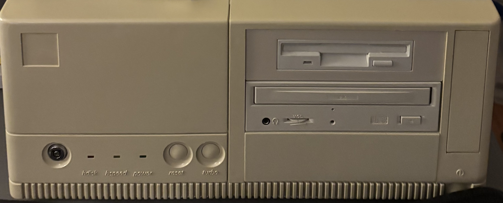

# Self-Assembled Pentium-120

| CPU             | Motherboard     | RAM      | Video         | Sound            | Ethernet | Storage | Floppy      | Optical   |
|-----------------|-----------------|----------|---------------|------------------|----------|---------|-------------|-----------|
| Pentium 120MHz | AOpen AP5VM | 32MB SDRAM | Diamond Stealth 64 Video VRAM | Sound Blaster 16 | 10Base-T | 8GB CF  | 3.5" 1.44MB | 8X CD-ROM |

## Personal Notes

Here is a history of the systems the case has housed over the years:

### Pentium-120 with MB-8500TEC motherboard

The case originally housed a Pentium system that I put together myself when I was in high school. The system came together after the Dell 486 I got for my birthday in 1993 got hit by lightning. I took several parts that still worked from the dead 486 and bought the rest from mail order ads in Computer Shopper to build the following system:

- [Baby-AT Desktop Case](Case/README.md)
- [Hipro 200W Power Supply](../../parts/power/Hipro-200W/README.md)
- Biostar MB-8500TEC motherboard (new)
- [Pentium-120 P54C CPU](../../parts/cpu/Intel-P54C-120-SX994/README.md) (new)
- 16MB EDO RAM (new)
- Diamond Stealth 64 video card (new)
- Sound Blaster AWE32 (from 486)
- [Sony 2X CD-ROM drive](../../parts/storage/Sony-CDU55E/README.md) (from 486)
- Canon combo floppy drive (from 486)
- Fujitsu 1GB hard drive (new)

Between my freshman and sophomore year in college, I scavenged several parts out of my original Pentium system for the new K6 system I was building, then cobbled together a working system from the remaining parts in this case plus some spare parts I had on hand:

- [8MB FPM RAM](../../parts/memory/Samsung-4MB-FPM/README.md) (from 486)
- [DFI VG-3000 video card](../../parts/video/DFI-VG3000/README.md) (from 386SX)
- [Sony 2X CD-ROM drive](../../parts/storage/Sony-CDU55E/README.md) (from 486)
- [320MB Western Digital hard drive](../../parts/storage/Caviar-2340-340MB/README.md) (from 486)

After that summer, I went back to college and forgot about the system for nearly 20 years until I found it in my parent's storage and brought it home.

When I tried to get the system running again in 2017, the RTC clock battery on the motherboard had died and the computer wouldn't boot without it. I damaged the motherboard while trying to desolder and replace the clock chip, and I was unable to get the combo floppy drive working again. 

### Pentium-120 with Micropolis M54Hi-Plus motherboard

I kept the case and PSU while buying other parts to rebuild a system similar to the original. The system I put together in 2017 consisted of the following components:

- [Baby-AT Desktop Case](Case/README.md)
- [Hipro 200W Power Supply](../../parts/power/Hipro-200W/README.md)
- Micropolis M54Hi-Plus Motherboard
- [Pentium 120MHz P54C CPU](../../parts/cpu/Intel-P54C-120-SY033/README.md)
- 32 MB EDO RAM
  - [2x 8MB Hitachi EDO DRAM](../../parts/memory/Hitachi-8MB-EDO/README.md)
  - [2x 8MB Mitsubishi EDO DRAM](../../parts/memory/Mitsubishi-8MB-EDO/README.md)
- [Diamond Stealth 64 video card](../../parts/video/Diamond-Stealth64/README.md)
- Onboard Creative Vibra16 sound chip
- [Mitsumi 8X CD-ROM drive](../../parts/storage/Mitsumi-CRMC-FX810T4/README.md)
- [Bytecc BT-145 3.5" 1.44MB floppy drive](../../parts/storage/Bytecc-BT-145/README.md)
- [Syba IDE to CF Adapter](../../parts/storage/Syba-IDE-CF-Adapter/README.md)

In 2025, I damaged the southbridge on the motherboard when I dropped a multimeter probe into an ISA slot while it was powered on. It still worked but wouldn't recognize ISA cards anymore. I eventually kept the CPU, RAM, and COAST module and gave the board away at the free table of the local retro meetup.

### Detour: 486DX2-66 with Asus PVI-486SP3 motherboard

Since I already had another Socket 7 system with the [Juniper Valley K6 system](../Juniper-Valley-K6/README.md), I decided to take a detour and built a 486 system using an [Asus PVI-486SP3 motherboard](../../parts/motherboard/Asus-PVI-486SP3/README.md) in this case. See the motherboard history for the details of that system.

In 2026, the 486 motherboard started intermittently failing to POST when turbo was enabled. For once, I didn't cause this motherboard's demise, but thus far I have not been able to get it working reliably again, so I removed it from the case and restored it to its original Pentium 120 configuration.

### Pentium-120 with AOpen AP5VM motherboard

After the 486 detour, I decided in 2026 to get yet another Socket 7 motherboard and restore the system to its original Pentium 120 configuration:

- [Baby-AT Desktop Case](Case/README.md)
- [Hipro 200W Power Supply](../../parts/power/Hipro-200W/README.md)
- [AOpen AP5VM Socket 7 Motherboard](../../parts/motherboard/AOpen-AP5VM/README.md)
- [Pentium 120MHz P54C CPU](../../parts/cpu/Intel-P54C-120-SY033/README.md)
- [Samsung 32MB PC100 SDRAM DIMM](../../parts/memory/Samsung-32MB-PC100-SDRAM/README.md)
- [Diamond Stealth 64 video card](../../parts/video/Diamond-Stealth64/README.md)
- [Sound Blaster 16 (CT2230) 16-bit Sound Card](../../parts/sound/SoundBlaster-CT2230/README.md)
- [Serdaco DreamBlaster S2 Wavetable Daughterboard](../../parts/sound/Serdaco-DreamBlaster-S2/README.md)
- [SMC EtherEZ 8416T 10Base-T Ethernet Adapter](../../parts/network/SMC-8416T/README.md)
- [Mitsumi CRMC-FX810T4 8x CD-ROM Drive](../../parts/storage/Mitsumi-CRMC-FX810T4/README.md)
- [Bytecc BT-145 3.5" 1.44MB floppy drive](../../parts/storage/Bytecc-BT-145/README.md)
- [Syba IDE to CF Adapter](../../parts/storage/Syba-IDE-CF-Adapter/README.md)
