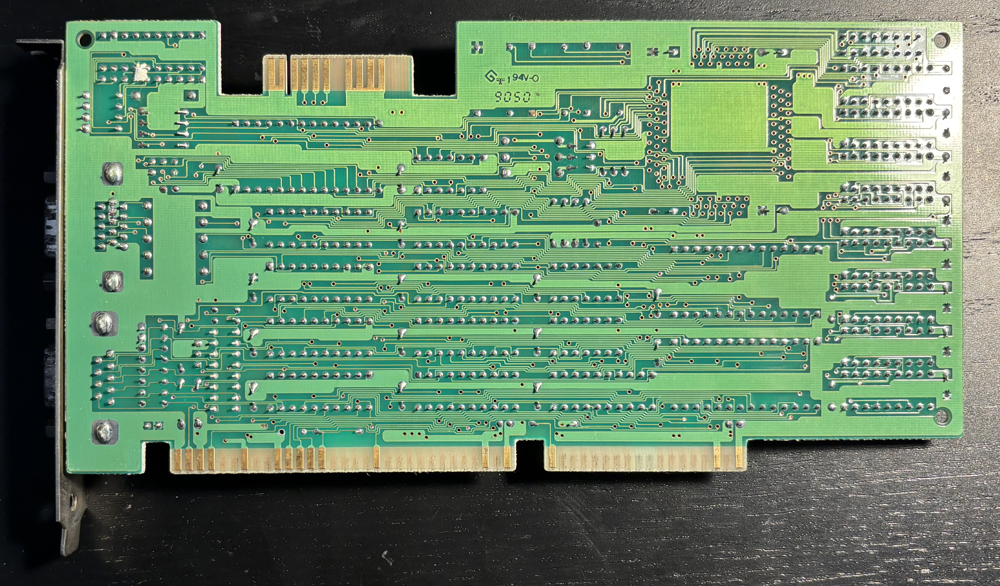
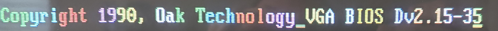

# DFI VG-3000 VGA Board

The DFI VG-3000 is an ISA VGA board based on the Oak Technology OTI037C graphics controller and a Samsung KDA0467 RAMDAC.  It has both 15-pin analog VGA and 9-pin digital MDA/CGA/EGA outputs, with DIP switches to configure the monitor type. When configured for an MDA monitor, it also supports Hercules graphics. It includes 256KB of video RAM and supports resolutions up to 800x600 at 16 colors.

## Documentation
- [MTL Jumper Manual](VG-3000.pdf)
- [OTI037C Datasheet](OTI037C.pdf)
- [KDA0467 Datasheet](KDA0476.pdf)

## Personal Notes

This board was originally installed in a 16MHz 386SX system that I had at home in junior high, circa 1991. Before I left for college in 1997, I cobbled together a working system from spare parts including this board, then forgot about it for 20 years until I found it in my parents' storage and took it home. The board sat unused in my collection until 2025, when I installed it in my newly acquired Zenith Z-248 system. I find the colorful animated Oak Technology banner very nostalgic, since I watched it many times on one of my earliest computers.

