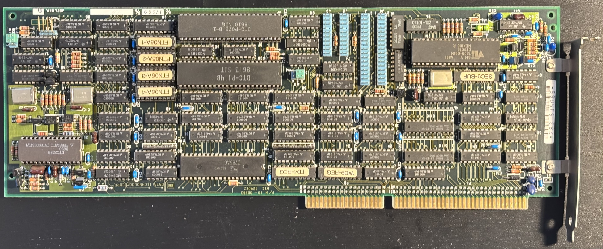
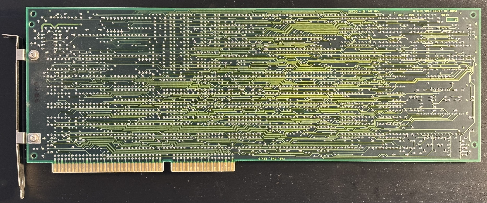

# DTC 5290CZ Disk Controller Board

The DTC 5290CZ is a MFM hard drive and floppy controller supporting up to two floppy drives and two MFM hard drives.

I have not been able to find much online about this card.  The closest thing I could find was a jumper manual for a [DTC 5280CZ](DTC5280CZ.pdf), but that is a different board with an external floppy connector, and the jumpers on my board don't match what is shown there.

## Connectors

| Label | Purpose                  |
|-------|--------------------------|
| J4    | Floppy cable             |
| J1    | MFM control cable        | 
| J2    | MFM primary data cable   |
| J3    | MFM secondary data cable |

## Jumpers

The board also contains the several jumpers, but I have no information on what they do:

- W1 and W2 are in a block together near the activity LED connector. They are both configured in the upper position.
- W3 and W4 are in a block together near the proprietary chips that I assume are part of the MFM controller. They are both configured in the left position.

The jumper manual for the DTC5280CZ says two of the jumpers select the I/O address of the MFM controller and that two are factory set and should not be altered. I suspect a similar situation applies to my model but I have no idea which jumpers do what.

## Chips

- NEC [uPD765AC](UPD765B.PDF) floppy controller chip
- The other large chips on the board seem to be proprietary DTC controller chips for which no information is available online.