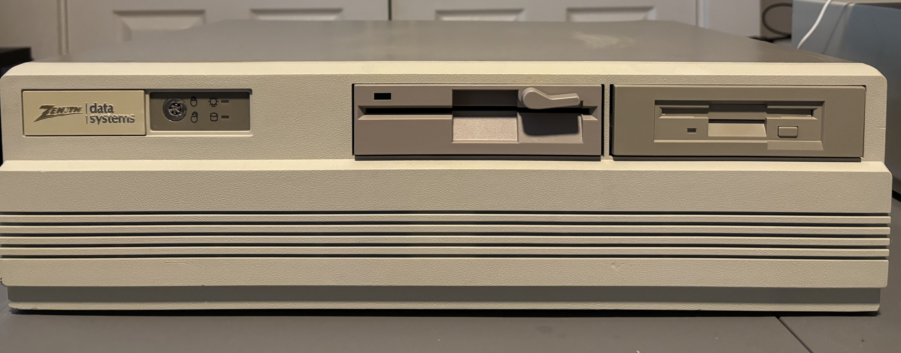
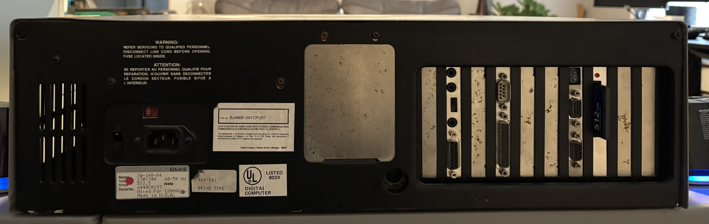
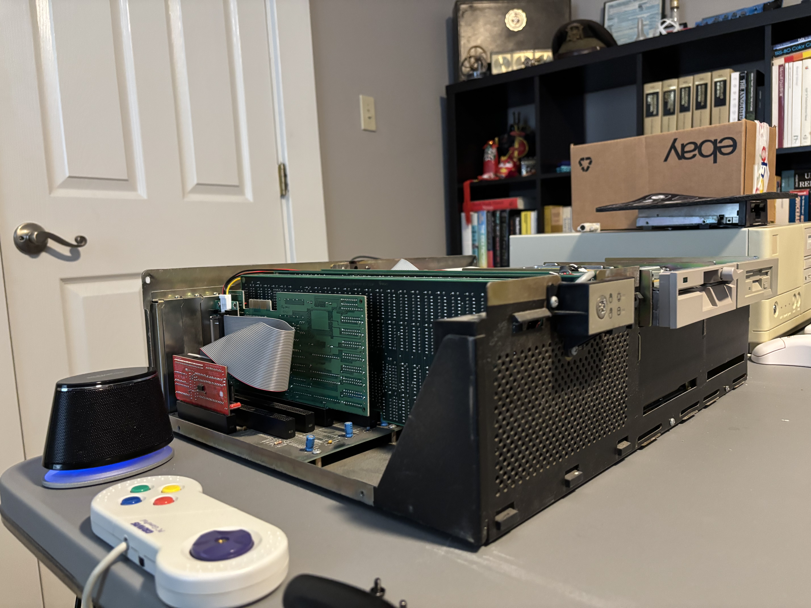
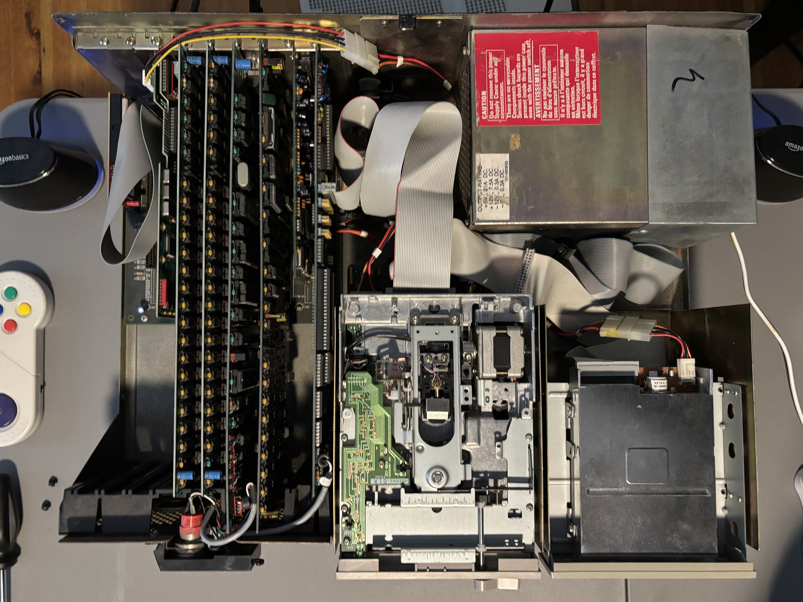
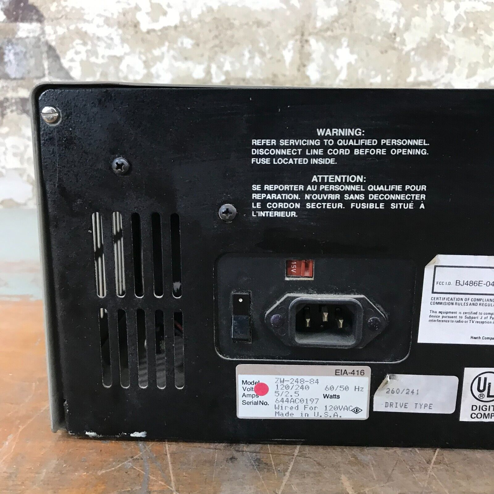
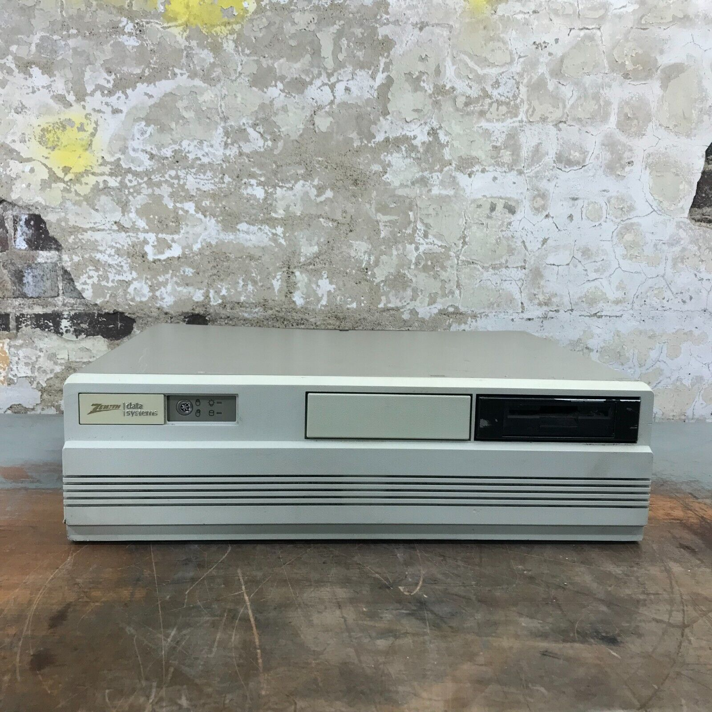
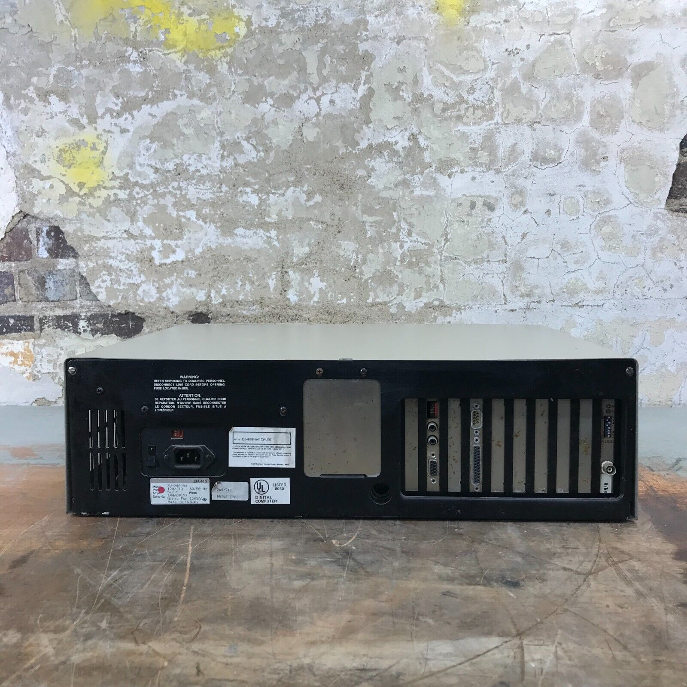
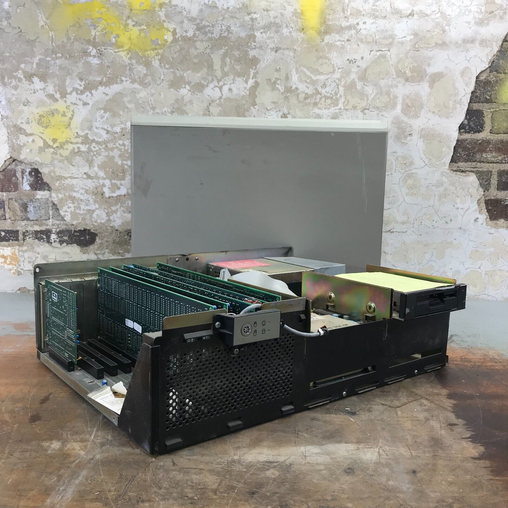
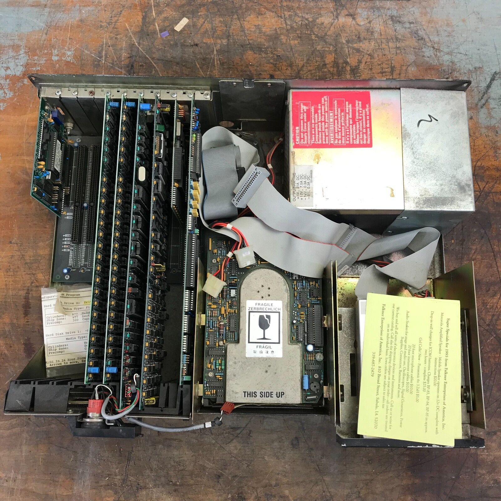

# Zenith Z-248 AT-compatible 8MHz 286

The Zenith ZW-248-84 is an AT-compatible 8MHz 286 system in the Z-200 series. It has a backplane-based design where the motherboard only contains slots and passive components, and the CPU, RAM, and chipset are on plugin boards.

## Acquisition

Bought from the [Bits Please](https://www.ebay.com/str/bitsplease) store on eBay in January 2025.

## Original Components

- [Zenith Z-248 10-slot passive backplane](Z248-Backplane/README.md)
- [Zenith Z-248 CPU board with 286 CPU and 512K RAM](Z248-CPU/README.md)
- [Zenith Z-248 I/O board with chipset, RTC, serial, and parallel ports](Z248-IO/README.md)
- [Zenith Z-445 Memory expansion boards (2)](Z445-RAM/README.md)
  - Extra 128K base memory for 640K total 
  - 2.5M extended memory
- [DTC 5290-CZ Floppy and MFM hard drive controller](DTC-5290CZ/README.md)
- [Seagate ST-4051 42MB MFM hard drive](Seagate-ST4051/README.md)

## Removed Components

- [Compex ANET/1 ARCNET adapter](../../parts/network/Compex-ANET1/README.md)
- [Paradise AutoSwitch EGA card with PEGA1A chip](../../parts/video/Paradise-PEGA1A/README.md)

## Added Components

- [DFI VG-3000 VGA card with OTI037C chip](../../parts/video/DFI-VG3000/README.md)
- [Sound Blaster 2.0 (CT1350B)](../../parts/sound/SoundBlaster-CT1350B/README.md)
- [Teac FD-235HF 3.5" 1.44MB floppy drive](../../parts/storage/Teac-FD235HF/README.md)
- [Teac FD-55GFR 5.25" 1.2MB floppy drive](../../parts/storage/Teac-FD55GFR/README.md)
- [Lo-Tech XT-CF 8-bit IDE interface](../../parts/storage/Lotech-XTCF/README.md)
  - Rear slot CF adapter
  - 512MB CF Card

## Documentation

### Brochures

- [Z-248 Brochure](Z248-Brochure.pdf)

### Manuals

- [Z-200 Owner's Manual](Z200-Owners-Manual.pdf) (from [BitSavers](https://bitsavers.org/pdf/zenith/z200/))
- [Z-200 Diagnostics](Z200-Diagnostics.pdf) (from [BitSavers](https://bitsavers.org/pdf/zenith/z200/))
- [Z-200 Technical Reference Manual](Z200-Technical-Reference.pdf) (from [archive.org](https://archive.org/details/595-3522-2-z-200-series-technical-reference-manual-1986))

### Articles

#### Byte

- [Four IBM PC AT Clones](Byte-4-IBM-PC-AT-Clones.pdf): in Byte's December 1986 issue, Wayne Rash, Jr. compares the Zenith Z-248 and Z-241 with two other contenders in the AT clone market. Spoiler, the Z-248 wins.
- [Computing at Chaos Manor: Bye-Bye Big Kat](Byte-Chaos-Manor-Bye-Bye-Big-Kat.pdf): in Byte's May 1987 issue, Jerry Pournelle bids farewell to Big Kat the Kaypro and welcomes Zelda the Z-248 to Chaos Manor.
- [Rating the IBM Compatibles](Byte-Rating-the-IBM-Compatibles.pdf): in Byte's "Inside the IBM PCs" extra issue from 1987, Robert G. Brookshire introduces "multidimensional analysis: a new approach to assess computer performance", and ranks many PC-compatible systems using his methodology.  The Z-248 comes in 5th, two places ahead of the original 6MHz IBM PC AT.

#### REMark

- [Perpetual Upgrading of a Z-248](Remark-Perpetual-Upgrading-of-a-Z-248.pdf): in REMark's January 1992 issue, Nic Visco discusses the upgrades he's made to his Z-248.
- [Upgrading a Z-248 to a 386SX](Remark-Upgrading-a-Z-248-to-a-386-SX.pdf): in REMark's May 1992 issue, Nic Visco picks up where his first article left off and discusses upgrading his Z-248 with a 386SX processor.

## Software

- [Z-200 Diagnostics at WinWorld](https://winworldpc.com/download/c2ae0951-5247-6211-c3a4-c28d587054ef)
- [Z-200 GW-BASIC Version 3 at WinWorld](https://winworldpc.com/download/5563142e-4763-11c3-a4c2-8d587054c392)

## Restoration Notes

### Power supply
- For initial testing of the power supply, I removed all the components from the backplane and powered it up with a known bad IDE hard drive connected to provide a load.  
- After the power supply stabilized, I checked all the voltages and confirmed that they were correct before putting the other parts back in.
- Originally the system seemed a bit unstable and wouldn't always boot, with the diagnostic LED indicating a CPU fault. 
- After running for a few hours, it fully stabilized (most likely after all the electrolytic caps fully reformed).

### 3.5" floppy drive
- The drive's mechanism was so stiff that it wouldn't accept disks that I tried to insert.
- I attempted to clean and lubricate it, but the mechanism is very corroded and it wouldn't seek even after my attempts to revive it.
- I removed it and replaced it with the TEAC 3.5" drive. I successfully booted DOS 3.31 from the new floppy drive.

### MFM hard drive
- After reconnecting the drive, it spun up and booted DOS, but it had a ton of bad sectors and very few files were readable.
- I used SpeedStor 6.5 to low-level format the drive and then installed DOS 3.31 on it. It has worked reliably for many hours since then.
- I eventually disconnected it from power and the controller and disabled it in the BIOS, but left it in the case. My reasons were to reduce system noise and prevent wear to the drive.

### Upgrades

- Replaced EGA card with a VGA card since I don't have an EGA monitor.
- Added the Sound Blaster
- Added the XT-CF IDE adapter
- Removed the ARCNET adapter since I have no way to test or use it currently and I needed the slot.

## Personal Notes

My dad ran his pharmacy on a similar Z-200 system from the mid-80s to early 90s. Originally he had the 286 model, but he upgraded it to a 386 with a kit sold by Zenith. He brought it home before using it at his store, and I have memories around 7 or 8 of watching him play Zork and King's Quest on it, and playing Mixed-Up Mother Goose myself. 

Later in junior high, circa 1991, I had a generic 16MHz 386SX at home, which was the source of the VGA board and keyboard I am using with this system.  The 386SX also had a Sound Blaster 1.5 and TEAC floppy drives of the same models that I have installed in this Z-248 now.  My current configuration is therefore a bit of a hybrid between these two systems.

## Additional Photos

### Current Configuration

#### Case Open

#### Case Labels

### Original Configuration

#### Front and Rear

#### Case Open

