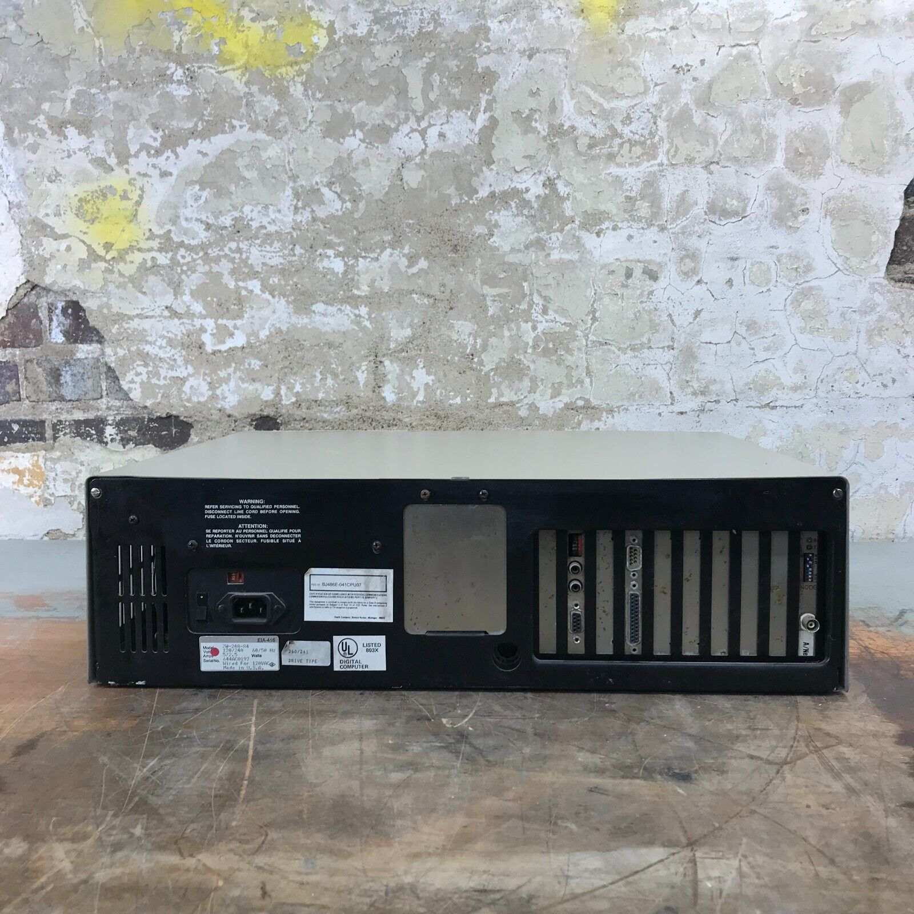

# Zenith Z-248 AT-compatible 8MHz 286

The Zenith ZW-248-84 is an AT-compatible 8MHz 286 system in the Z-200 series. It has a backplane-based design where the motherboard only contains slots and passive components, and the CPU and chipset are on plugin boards.

## System Components

- [Passive 10-slot backplane (Zenith Z-248)](Zenith-Z248-Backplane/README.md)
- [8MHz 80286 CPU Board with 512K RAM (Zenith Z248)](Zenith-Z248-CPU-Board/README.md)
- [AT-compatible I/O board with RTC, serial, and parallel (Zenith Z248)](Zenith-Z248-IO-Board/README.md)
- [Floppy and MFM hard drive controller (DTC 5290CZ)](DTC-5290CZ/README.md)
    - [3.5" 1.44MB Floppy Drive (Teac FD-235HF-6240)](Teac-FD-235HF-6240/README.md)
    - [5.25" 1.2MB Floppy Drive (Teac FD-55GFR-654-U)](Teac-FD-55GFR-654-U/README.md)
- [Two memory expansion boards (Zenith Z-445)](Zenith-Z445-RAM-Board/README.md)
  - Extra 128K base memory for 640K total 
  - 2.5M extended memory
- [Oak Technology OTI037C-based VGA Adapter (DFI VG-3000)](DFI-VG3000-VGA-Board/README.md)
- [Sound Blaster 2.0 Sound Card (CT1350B)](SoundBlaster-CT1350B/README.md)
- [XT-IDE 8-bit IDE Inteface (Lo-Tech XT-CF)](Lo-tech-XT-CF-Controller/README.md)
  - Rear slot CF adapter
  - 512MB CF Card

## Removed Components

- Sony 3.5" 1.44MB floppy drive
- [ARCNET network adapter (Compex ANET/1)](../parts/Compex-ANET1/README.md)
- [Paradise PEGA1A-based EGA Card (AutoSwitch EGA)](../parts/Paradise-AutoSwitch-EGA/README.md)

## Documentation

- [Z-248 Brochure](Z-248_Brochure.pdf)
- [Z-200 PC Series Owner's Manual](Z-200_PC_Series_Owners_Manual.pdf) (from [BitSavers](https://bitsavers.org/pdf/zenith/z200/))
- [Z-200 PC Diagnostics](Z-200_PC_Diagnostics.pdf) (from [BitSavers](https://bitsavers.org/pdf/zenith/z200/))

## Software
- [Zenith Z-200 PC Diagnostics](Z-200_Diagnostics.zip) (from [WinWorld](https://winworldpc.com/download/c2ae0951-5247-6211-c3a4-c28d587054ef))
- [Zenith Z-200 GW-BASIC Version 3](Z-200_GW-Basic_Version_3.zip) (from [WinWorld](https://winworldpc.com/download/5563142e-4763-11c3-a4c2-8d587054c392))

## Personal Notes

I bought this system in January 2025 from the [Bits Please](https://www.ebay.com/str/bitsplease) on eBay. For initial testing of the power supply, I removed all the components from the backplane and powered up it with a sacrificial IDE hard drive connected.  After the power supply stabilized, I checked all the voltages and confirmed that they were correct before putting the other parts back in. Other than the original floppy drive, everything worked. Originally it seemed a bit unstable and wouldn't boot sometimes, but after running for a while it has stabilized (most likely after the electrolytic caps fully reformed).  I swapped the EGA for a VGA card since I don't have an EGA monitor, and added the Sound Blaster 2.0 and XT-CF cards.  I replaced the broken 3.5" drive with a Teac model and added a Teac 5.25" drive.

My dad ran his pharmacy on a similar system from the mid-80s to early 90s. Originally he had the 286 model, but he upgraded it to a 386 with a kit sold by Zenith. He brought it home before using it at his store, and I have memories of playing Zork and King's Quest on it when I was around 7 or 8. Later in junior high, I had a 16MHz 386SX at home, which was the source of the VGA board and keyboard I am using with this system.  The 386SX also had same TEAC floppy drive models that I installed in this system, and a Sound Blaster 1.5.  My current configuration is therefore a bit of a hybrid between these two systems.

## Additional Photos

### Current Configuration

#### Case Open

#### Case Labels

### Original Configuration

#### Front and Rear

#### Case Open

