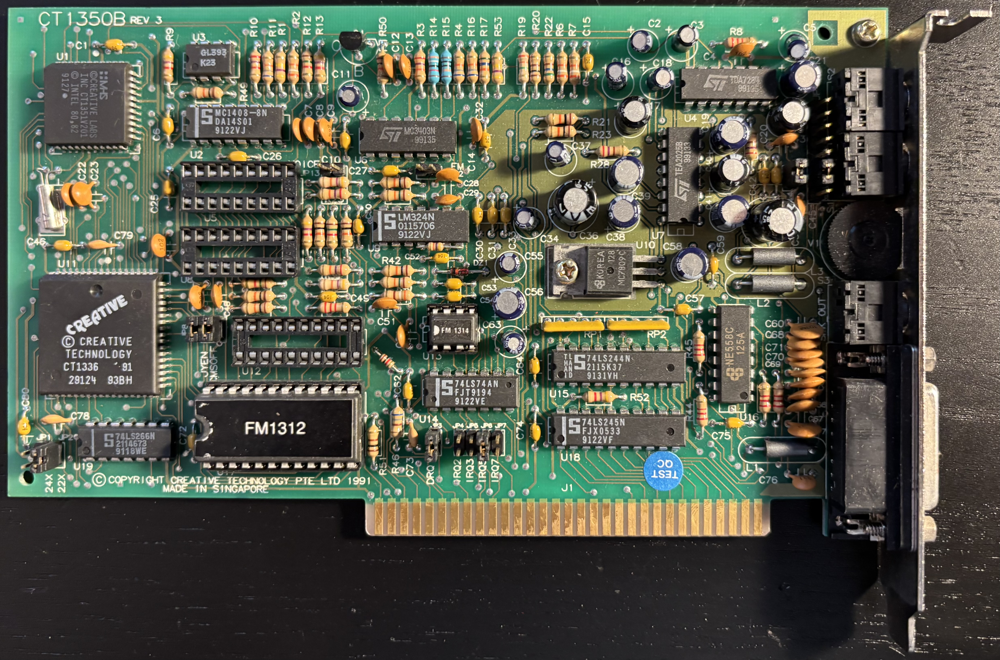
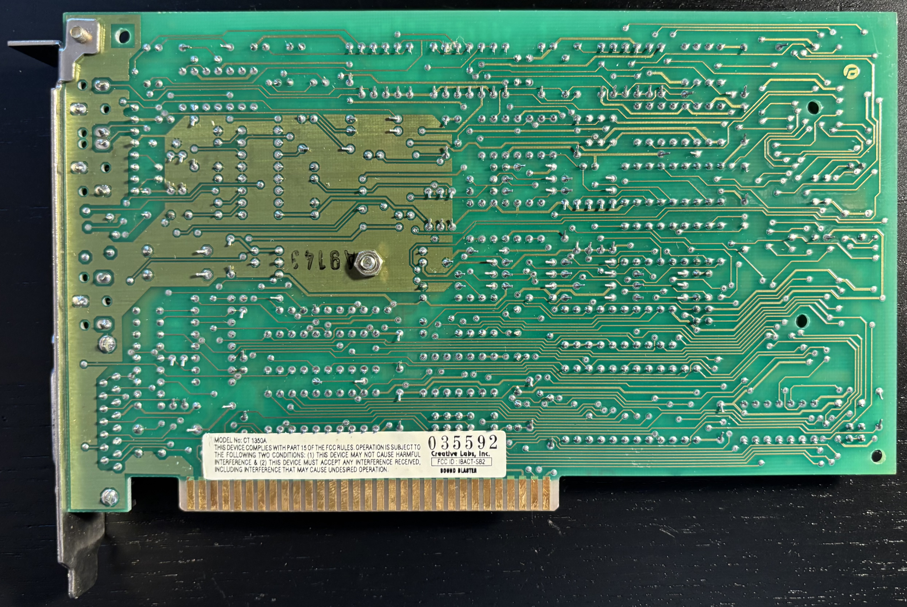

# Sound Blaster 2.0 Sound Card (CT1350B)

From the [Sound Blaster 2.0](https://en.wikipedia.org/wiki/Sound_Blaster#Sound_Blaster_2.0,_CT1350) section on Wikipedia:

The final revision of the original Sound Blaster, the Sound Blaster 2.0 was released in October 1991, CT1350, added support for "auto-init" DMA, which assisted in producing a continuous loop of double-buffered sound output. Similar to version 1.0 and 1.5, it used a 1-channel 8-bit DAC. However, the maximum sampling rate was increased to 44 kHz for playback, and 15 kHz for record. The DSP's MIDI UART was upgraded to full-duplex and offered time stamping features, but was not yet compatible with the MPU-401 interface used by professional MIDI equipment. The Sound Blaster 2.0's PCB-layout used more highly integrated components, both shrinking the board's size and reducing manufacturing cost.

Mine was made in Singapore, 43rd week of 1991.

## Documentation

- [Sound Blaster 2.0 Reference Manual](CT1350B-manual.pdf) from The Retro Web
- [MTL Jumper Manual for CT1350B](CT1350B-jumpers.pdf) from The Retro Web
- [CT1350B Schematic](CT1350B-schematic.pdf) reverse engineered by [Thermalwrong on Vogons](https://www.vogons.org/viewtopic.php?t=89275)
- [YM3812 (OPL2) Datasheet](YM3812.pdf) from The Retro Web
- [YM3014 (DAC) Datasheet](YM3014B.pdf) from The Retro Web

## Further Information
- [Sound Blaster 2.0 (CT1350)](https://www.dosdays.co.uk/topics/Manufacturers/creative/ct1350.php) on DOS Days
- [Sound Blaster 2.0 (CT1350)](https://theretroweb.com/expansioncards/s/creative-soundblaster-2-0-ct1350) on The Retro Web
- [CMS Logic Scheme for Sound Blaster 2.0](https://github.com/necroware/sbcms) by Necroware on GitHub