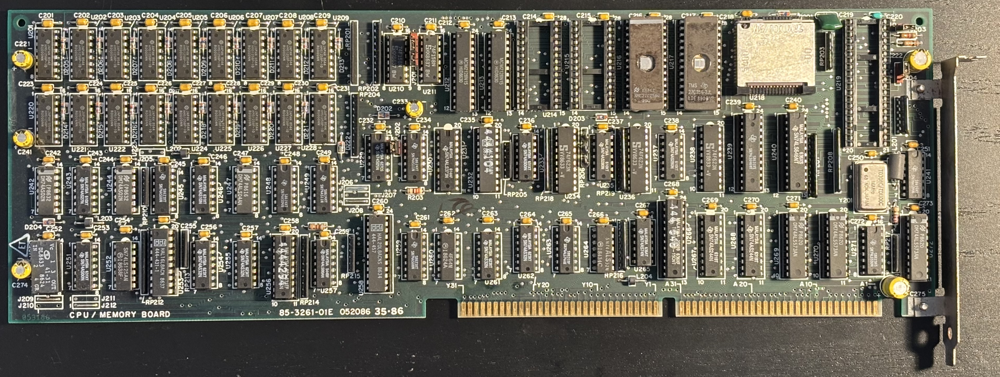

# Zenith Z-248 286 CPU Board

The Z-248 CPU board (part no. 85-3261-01E) contains the CPU and supporting circuitry.

## Documentation

- [Schematic](schematic.pdf) (from [BitSavers](https://bitsavers.org/pdf/zenith/z200/))
- [The Retro Web](https://theretroweb.com/motherboards/s/zenith-85-3261-01) database entry

## Chipset

- 8Mhz Intel 80286 processor (U218)
- 80287 FPU socket (U219)
- 4 27256 ROM sockets, 2 populated (U214-U217)
- 512KB RAM comprised of 16 HM51256 256Kx1 DRAMs (U201-U209, U220-U228)
- PALs and 74-series glue logic

## PALs

| Designator | Zenith Part Number | PAL Model | Purpose                   |
|------------|--------------------|-----------|---------------------------|
| U253       | 444-431-1          | 16L8A     | CPU and bus control logic |
| U232       | 444-410-4          | 16R8B     | CPU control logic         |
| U256       | 444-429-4          | 16R6A     | CPU delay logic           |
| U258       | 444-457            | 20L8A     | Misc control logic        |
| U266       | 444-548            | 20L8B     | Memory control logic      |

## CPU

The CPU is an Intel R80286-8 manufactured in Malaysia in the 19th week of 1986.

| Top                    | Bottom                         |
|------------------------|--------------------------------|
 |  |