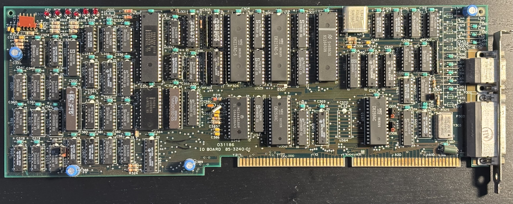
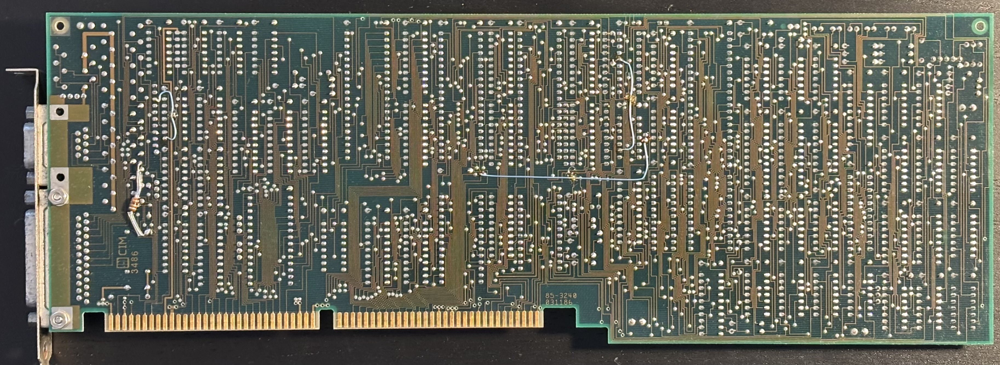

# Zenith Z-248 AT-compatible IO Board

The Z-248 IO board (part no. 85-3240-01) contains the chipset, RTC, serial port, and parallel port:

## Chipset

| Designator | Part Number | Purpose                           |
|------------|-------------|-----------------------------------|
| U311       | 8237A       | DMA Controller                    |
| U313       | 8237A       | DMA Controller                    |
| U345       | 8254        | Programmable Interval Timer       |
| U350       | 8259A       | Programmable Interrupt Controller |
| U353       | 8259A       | Programmable Interrupt Controller |
| U307       | 8042        | Keyboard Controller               |
| U348       | MC146818A   | Real-time clock                   |
| U315       | NS16450     | UART                              |

## PALs

| Designator | Zenith Part Number | PAL Model | Purpose                   |
|------------|--------------------|-----------|---------------------------|
| U341       | 444-436            | 14L8      | Address decode/control    |
| U309       | 444-471            |           | IO control B              |
| U310       | 444-425-1          |           | IO control A              |