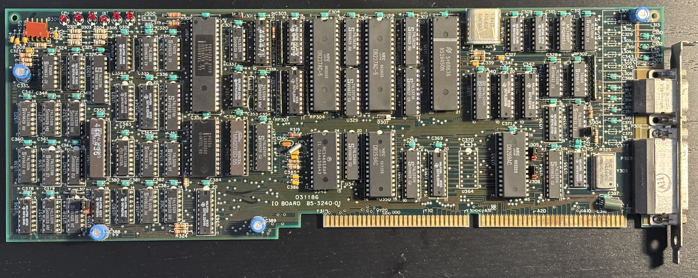
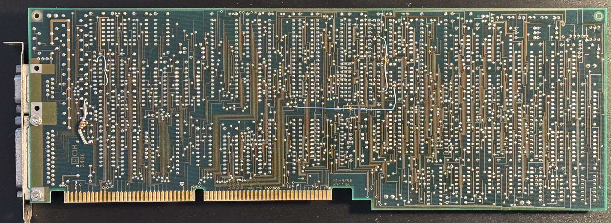

# Zenith Z-248 AT-compatible IO Board

The Z-248 IO board (part no. 85-3240-01) contains the chipset, RTC, serial port, and parallel port:

## Documentation

- [Schematic](schematic.pdf)
- [The Retro Web](https://theretroweb.com/motherboards/s/zenith-85-3261-01) database entry

## Chipset

| Designator | Part Number                | Purpose                           |
|------------|----------------------------|-----------------------------------|
| U311       | [8237A](8237.pdf)          | DMA Controller                    |
| U313       | [8237A](8237.pdf)          | DMA Controller                    |
| U345       | [8254](8254.pdf)           | Programmable Interval Timer       |
| U350       | [8259A](8259A.pdf)         | Programmable Interrupt Controller |
| U353       | [8259A](8259A.pdf)         | Programmable Interrupt Controller |
| U307       | [8042](8042.pdf)           | Keyboard Controller               |
| U348       | [MC146818A](MC146818A.pdf) | Real-time clock                   |
| U315       | [NS16450](NS16450.pdf)     | UART                              |

## PALs

| Designator | Zenith Part Number | PAL Model | Purpose                   |
|------------|--------------------|-----------|---------------------------|
| U341       | 444-436            | 14L8      | Address decode/control    |
| U309       | 444-471            |           | IO control B              |
| U310       | 444-425-1          |           | IO control A              |