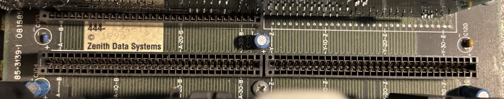
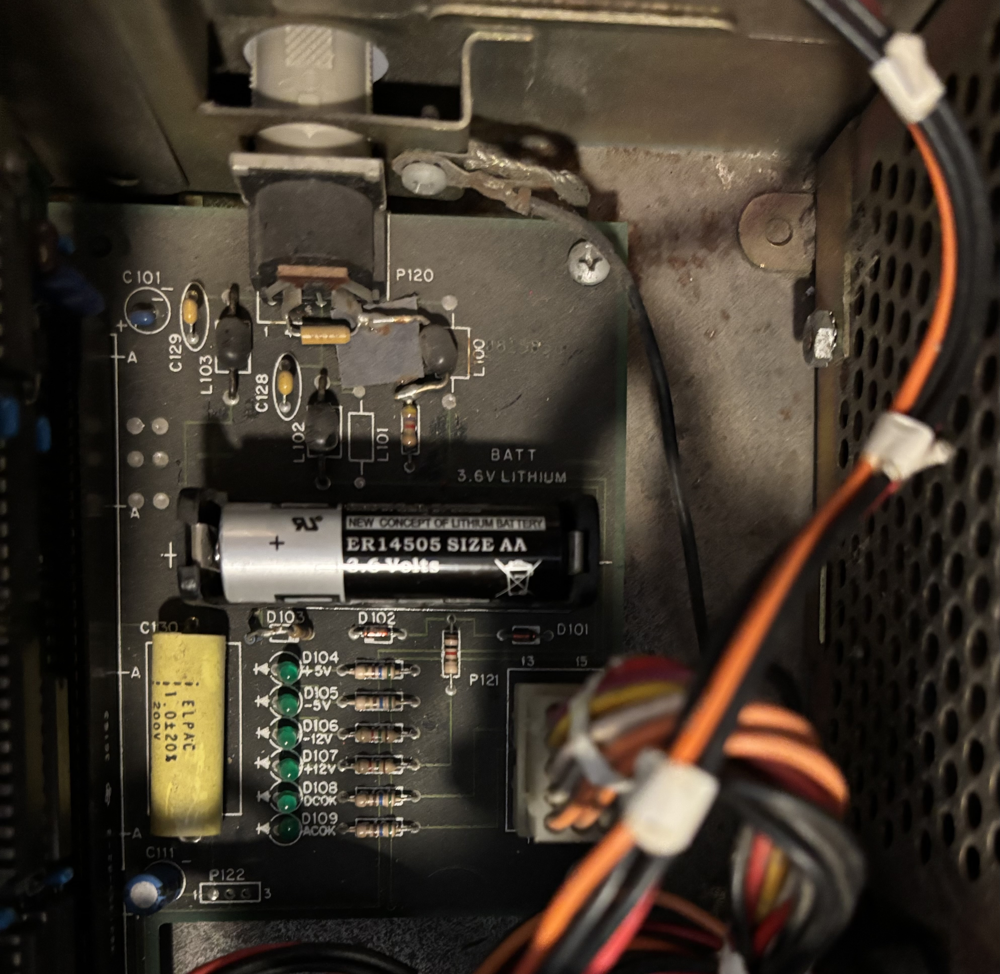
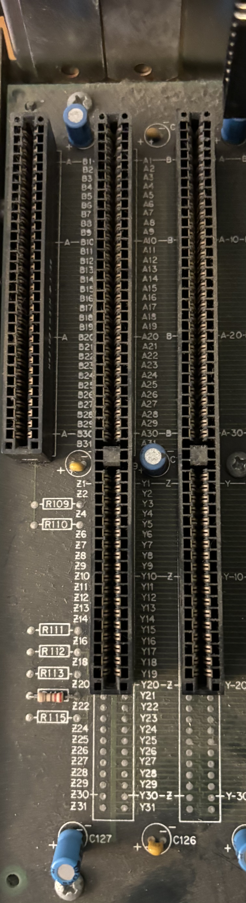

# Z-248 Backplane

Part number 85-3139-1

The Z-248 uses a passive backplane containing only a power connector, backup battery, keyboard connector, and expansion slots. Everything else, including the CPU, RAM, and chipset, is installed on an expansion board in one of the slots.

## Extended ISA Slots

The CPU, IO, and Memory boards have an extended ISA connector that is longer and has more connections than a standard 16-bit ISA connector.  This photo also shows the part number.

## Other Connectors

The other connectors on the backplane include:
- Proprietary power supply connector
- Green status LEDs for each power rail (+/-5V and +/-12V)
- Holder for 3.6V AA lithium battery
- AT keyboard connector

## Bus Pinout

The bus pinout is printed on the backplane. Even though the extended connector is not populated in this slot, the pinout for it is printed where it would have been soldered.

