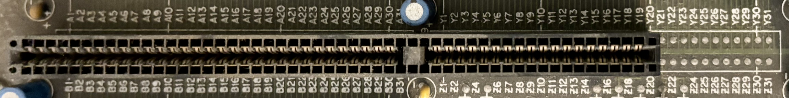
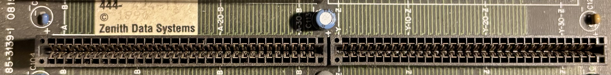

# Z-248 Backplane

The Z-248 uses a passive backplane (part no. 85-3139-1) containing only a power connector, battery holder, keyboard connector, and 10 expansion slots. Everything else is located on the expansion boards, including the CPU, RAM, and chipset.

## Bus Connectors

The 10 expansion slots include 2 8-bit ISA, 4 16-bit ISA, and 4 proprietary extended ISA slots.

The bus pinout is printed on the backplane. Pins Y/Z 21-31 are used by the proprieatry extended slots.

The CPU, IO, and Memory boards have a proprietary extended ISA connector that is longer and has more connections than a standard 16-bit ISA connector.  This photo also shows the part number (85-3139-1).

## Other Connectors

In addition to the ISA slots, the backplane contains several other connectors:

- AT keyboard connector
- Proprietary power supply connector
- Status LEDs for each power rail (+/-5V and +/-12V)
- Holder for 3.6V AA lithium battery

