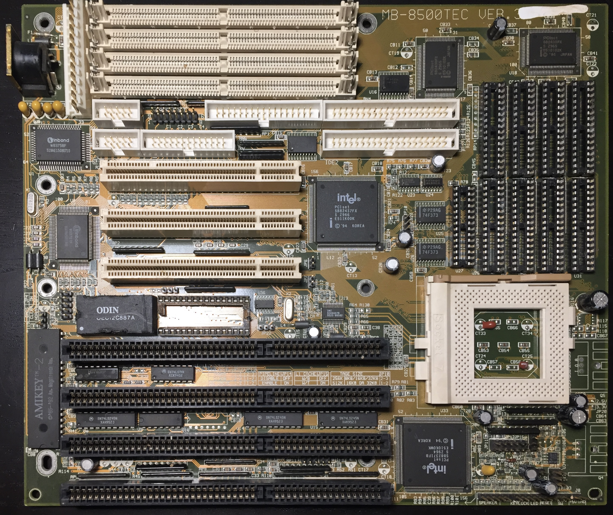

# Biostar MB-8500TEC v3 Socket 7 Motherboard

## Specifications

- Chipset: Intel 430FX (PCIset FX Triton I)
- CPU socket: Socket 7 (PGA321); supports Intel Pentium (P54C), AMD K5, Cyrix 6x86, WinChip C6, and WinChip 2 processors
- Front-side bus speeds: 50, 60, and 66 MHz
- Form factor: Baby AT, 254 × 218 mm
- Release year: 1995
- Cache: 256KB or 512KB
- Memory: up to 128MB of 72-pin FPM or EDO RAM
- Expansion slots: 4× 16-bit ISA and 3× PCI
- I/O: AT keyboard, floppy, game port, 2× IDE, parallel, and 2× serial

## Further Information

- [Biostar MB-8500TEC Ver. 3 motherboard entry](https://theretroweb.com/motherboards/s/biostar-mb-8500tec-ver.-3) on The Retro Web

## Personal Notes

I bought this motherboard new for the original [Pentium-120 system](../../../computers/Pentium-120/README.md) I assembled in high school. After recovering the system from storage nearly 20 years later, I found that the RTC battery had died and the computer would not boot without it. I damaged the board while trying to desolder and replace the RTC without the proper equipment, so I replaced it with a [Micronics M54Hi-Plus](../Micronics-M54Hi-Plus/README.md) in 2017.
