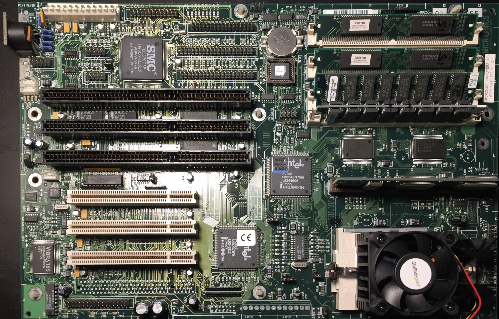
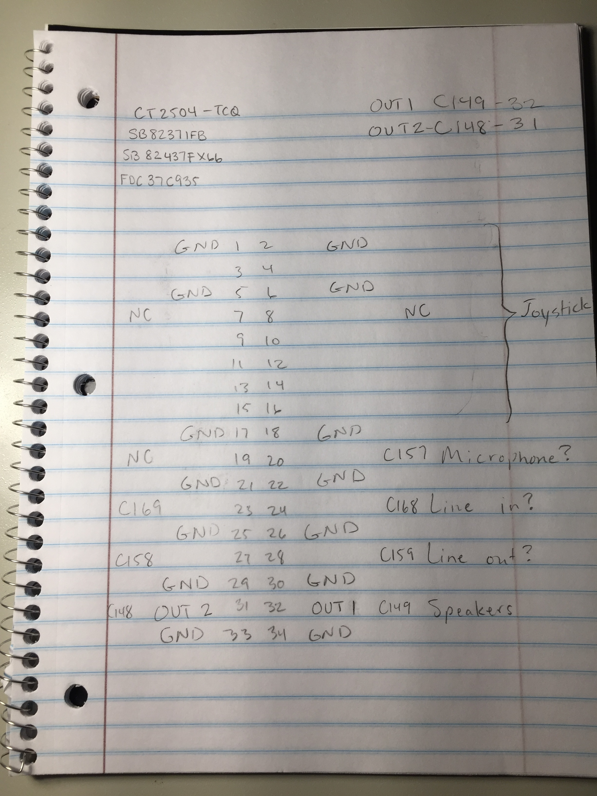

# Micronics M54Hi-Plus Socket 7 Motherboard

## Specifications

- Chipset: Intel 430FX (PCIset FX Triton I)
- CPU socket: Socket 7 (PGA321); supports Intel Pentium (P54C), AMD K5, Cyrix 6x86, WinChip C6, and WinChip 2 processors
- Front-side bus speeds: 50, 60, and 66 MHz
- Form factor: Baby AT, 337 × 216 mm
- Cache: 256KB or 512KB
- Memory: up to 128MB of 72-pin FPM or EDO RAM
- Expansion slots: 3× 16-bit ISA and 4× PCI
- I/O: AT keyboard, floppy, game port, 2× IDE, PS/2 mouse, parallel, and 2× serial
- Onboard audio: Creative CT2504 (Vibra 16S)

## Personal Notes

This board was manufactured sometime in 1996. I bought it in 2017 to replace the [Biostar MB-8500TEC](../Biostar-MB-8500TECv3/README.md) with a dead RTC battery that I failed to successfully replace. In 2025, I damaged this board's southbridge when I dropped a multimeter probe into an ISA slot while it was powered on. It still worked but wouldn't recognize ISA cards anymore. I eventually kept the CPU, RAM, and COAST module and gave the board away at a local retro meetup.

## Audio Header Pinout

The motherboard came without the audio/joystick breakout board for the onboard Vibra 16 chip, so I used a multimeter to trace ground and left/right audio output from the amplifier chip, then constructed a breakout cable for it.  I've included a snapshot of my notes in case it helps anybody.

## Further Information

- [Micronics M54Hi-Plus (09-00253-xx) motherboard entry](https://theretroweb.com/motherboards/s/micronics-m54hi-plus-09-00253-xx) on The Retro Web
