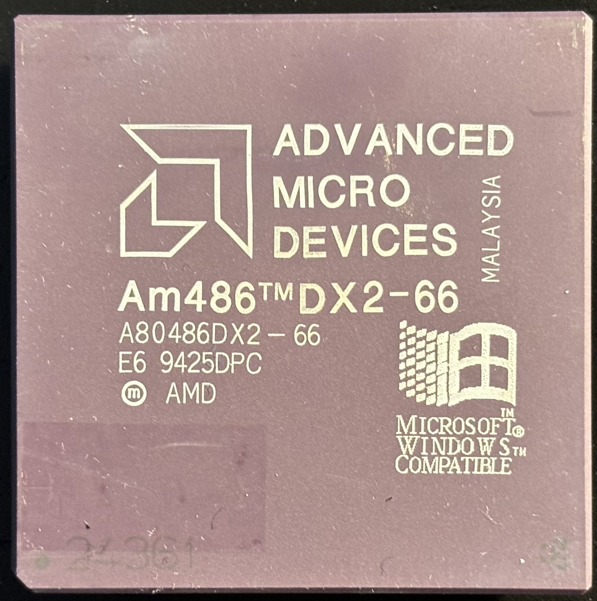
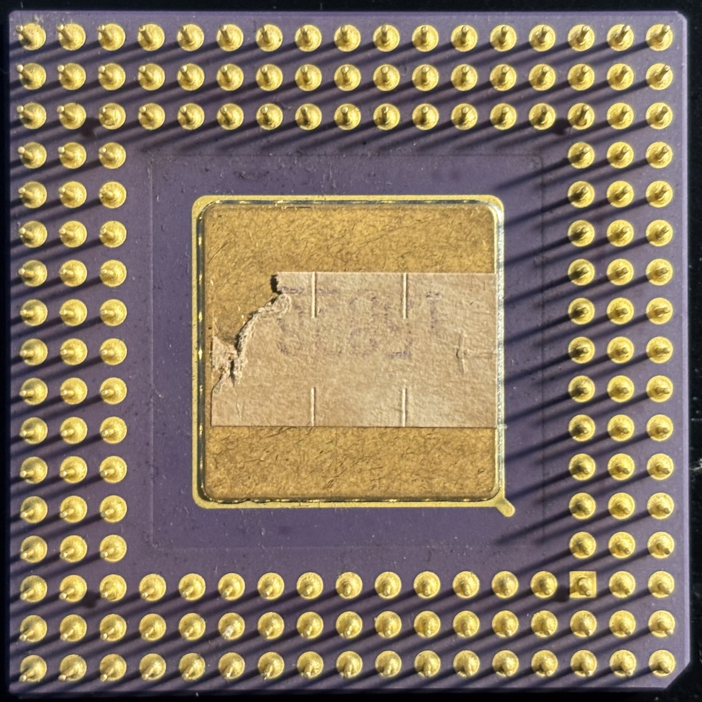

# AMD Am486DX2-66 CPU

The Am486DX2-66 is AMD's answer to Intel's i486DX2-66 with virtually identical specs and performance.

| Core Freq | Bus Freq | Multiplier | L1 Cache | L2 Cache | Voltage | Package  | Socket | Process |
|-----------|----------|------------|----------|----------|---------|----------|--------|---------|
| 66 MHz    | 33 MHz   | 2.0        | 8 KB     | None     | 5V      | CPGA-168 | 1/2/3  | 500 nm  |

| Top              | Bottom                 |
|------------------|------------------------|
|  |  |

## Further Information

- [Datasheet](datasheet.pdf) (from [Ardent Tool of Capitalism](https://www.ardent-tool.com/CPU/Docs.html))
- [AMD Am486 and 5X86](https://cpumuseum.jimdofree.com/museum/amd/am486-5x86/) at CPU Museum
- [Am486](https://en.wikipedia.org/wiki/Am486) on Wikipedia
- [The Ultimate AMD 486 Die & Packaging Guide](https://x86.fr/the-ultimate-amd-486-die-packaging-guide/) at x86.fr

## Personal Notes

This CPU was made in Malaysia during the 25th week of 1994. I bought it from a friend in the [DFW Retro Computing](https://www.facebook.com/groups/350060128451803) Facebook group in February 2025 along with the [Asus PVI-486SP3](../../motherboard/Asus-PVI-486SP3/README.md) motherboard it was installed in.

I had an Intel 486DX2-66 in my Dell 486 system that I got in high school in 1993.
