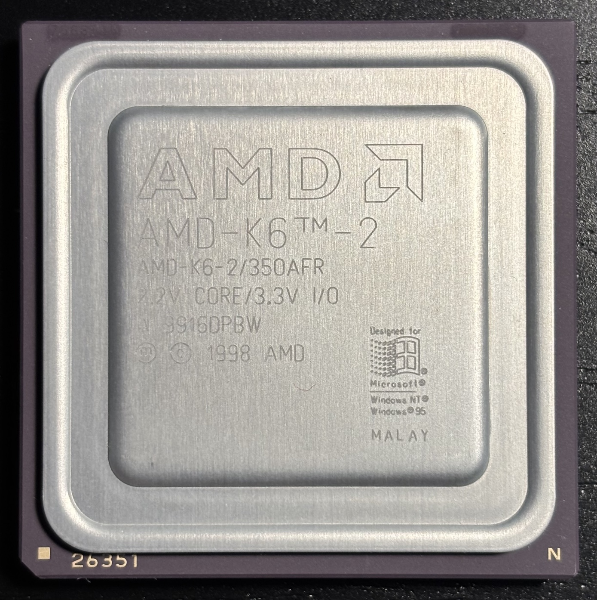
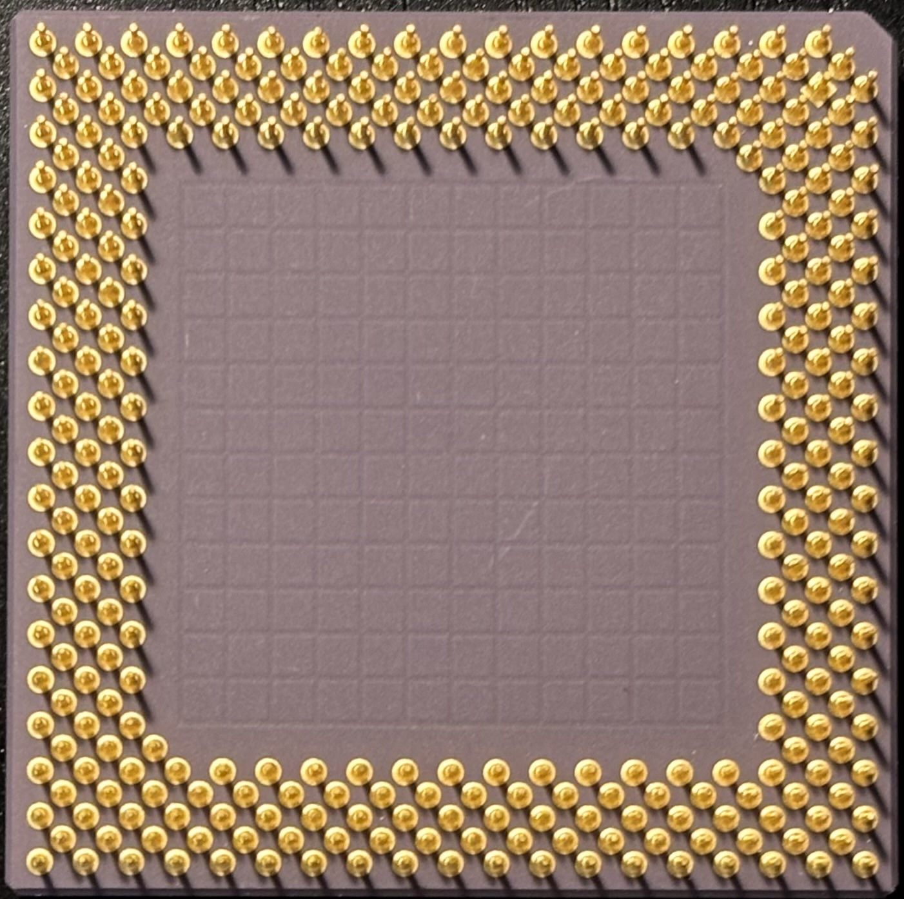

# AMD K6-2/350AFR Socket 7 CPU

| Top              | Bottom                 |
|------------------|------------------------|
|  |  |

| Core Freq | Bus Freq | Multiplier | L1 Cache  | L2 Cache | Core Voltage | I/O Voltage     | Package         | Socket  | Process |
|-----------|----------|------------|-----------|----------|--------------|-----------------|-----------------|---------|---------|
| 350 MHz   | 100 MHz  | 3.5        | 32KB/32KB | None     | 2.2V         | 3.3V            | CPGA-321        | Super 7 | 250 nm  |

## Personal Notes

This CPU was made in Malaysia during the 16th week of 1999.  It came in the [Juniper Valley K6 system](../../../computers/Juniper-Valley-K6/README.md), which I upgraded to a [K6-2+/570ACZ](../../../computers/Juniper-Valley-K6/AMD-K6-2+-570ACZ/README.md).

## Further Information

- [Datasheet](datasheet.pdf) (from [Ardent Tool of Capitalism](https://www.ardent-tool.com/CPU/Docs.html))