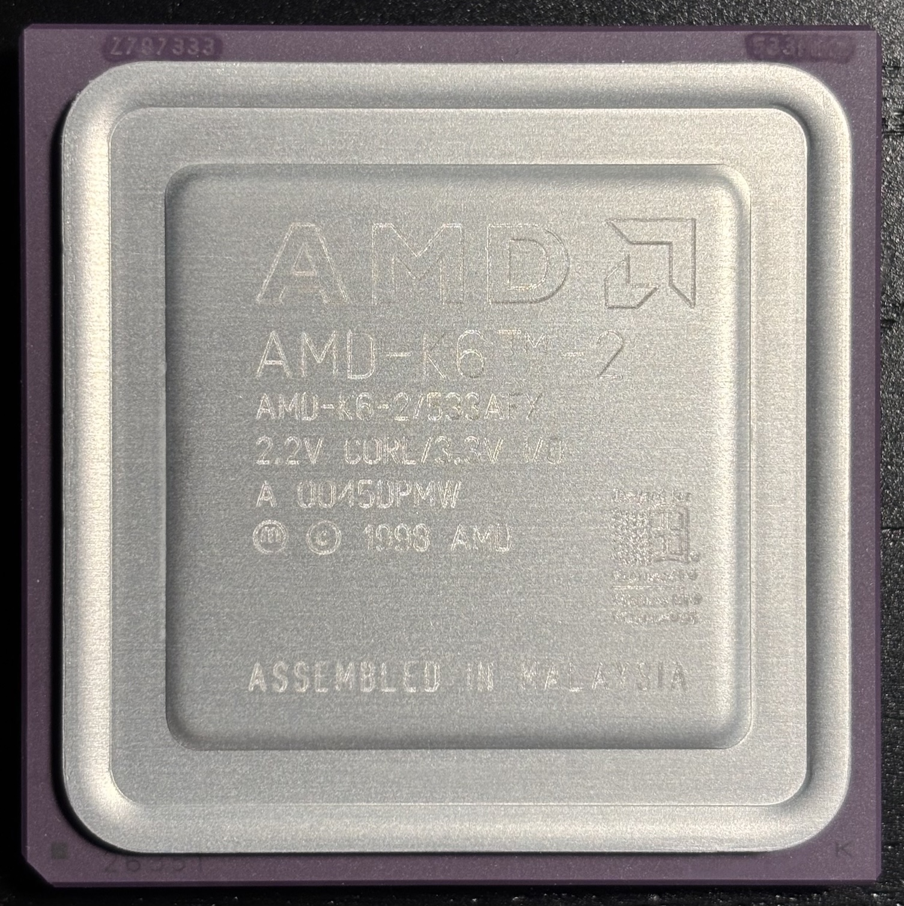
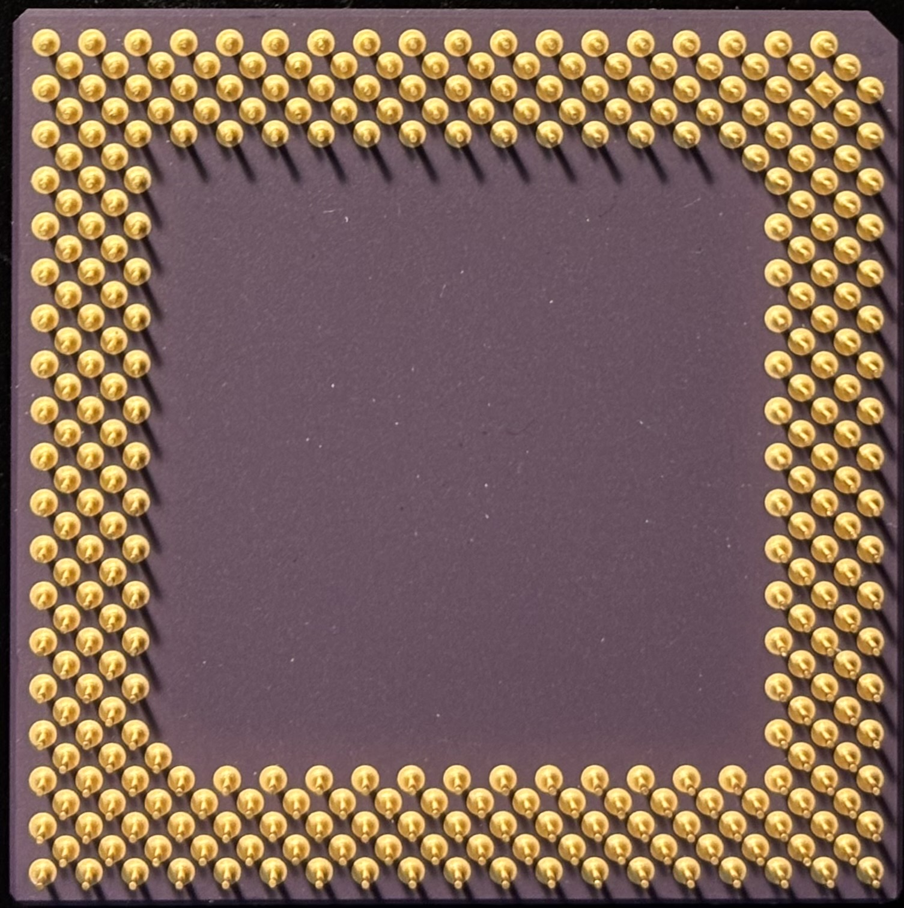

# AMD K6-2/533AFX Super Socket 7 CPU

| Top              | Bottom                 |
|------------------|------------------------|
|  |  |

| Core Freq | Bus Freq   | Multiplier | L1 Cache  | L2 Cache | Core Voltage | I/O Voltage     | Package  | Socket  | Process |
|-----------|------------|------------|-----------|----------|--------------|-----------------|----------|---------|---------|
| 533 MHz   | 97 MHz     | 5.5        | 32KB/32KB | 256KB    | 2.2V         | 3.3V            | CPGA-321 | Super 7 | 250 nm  |

## Personal Notes

This CPU was made in Malaysia during the 45th week of 2000. I bought it from the [MemoryMasters](https://www.ebay.com/str/memorymasters) store on eBay and had it installed in my [Juniper Valley K6 system](../../../computers/Juniper-Valley-K6/README.md) until I upgraded to the [K6-2+/570ACZ](../../../computers/Juniper-Valley-K6/AMD-K6-2+-570ACZ/README.md). I had it overclocked to 550MHz since my motherboard doesn't support a 97MHz FSB.

## Further Information

- [Datasheet](datasheet.pdf) (from [Ardent Tool of Capitalism](https://www.ardent-tool.com/CPU/Docs.html))