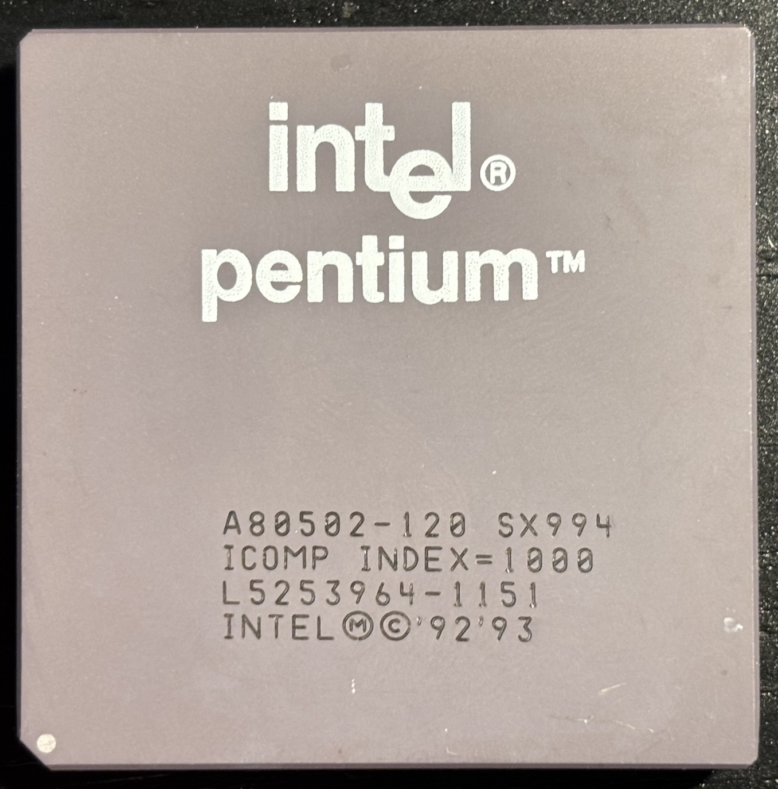
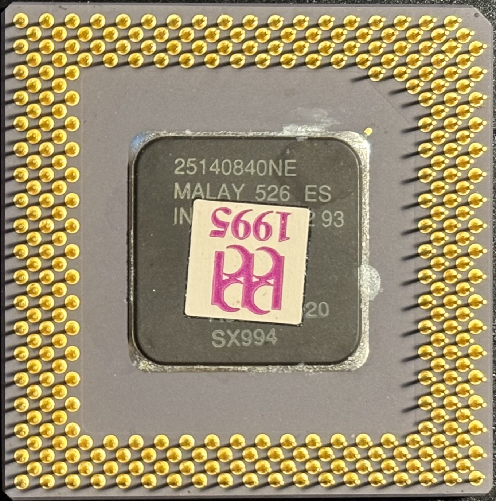

# Intel Pentium P54C 120MHz Socket 7 CPU

| Top              | Bottom                 |
|------------------|------------------------|
|  |  |

| Core Freq | Bus Freq | Multiplier | L1 Cache | L2 Cache | Voltage | Package         | Socket | Process |
|-----------|----------|------------|----------|----------|---------|-----------------|--------|---------|
| 120 MHz    | 60 MHz  | 2.0        | 8KB/8KB  | None     | 3.3V    | CPGA-296        | 7      | 600 nm  |

## Further Information

- [Datasheet](P54C-datasheet.pdf) (from [Ardent Tool of Capitalism](https://www.ardent-tool.com/CPU/Docs.html))

## Personal Notes

This CPU was made in Malaysia 25th week of 1995. I bought it in 1995 for the [Pentium system](../../../computers/Pentium-120/README.md#original-pentium-120) I originally built in the case that now houses my [Pentium-120](../../../computers/Pentium-120/README.md) system.
