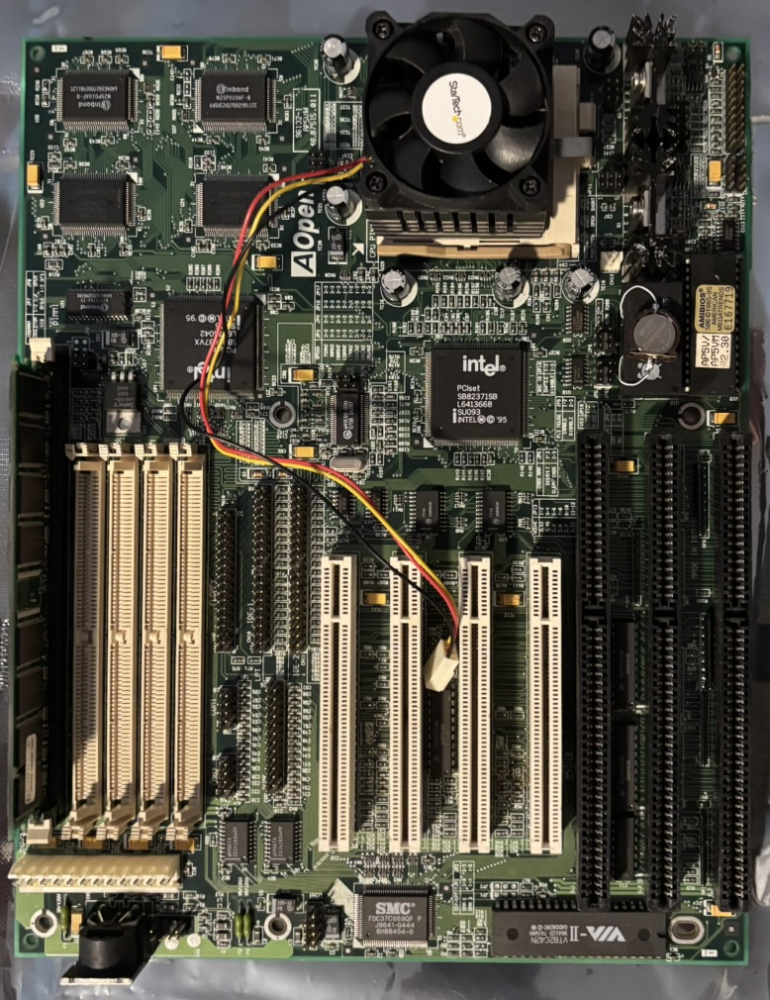
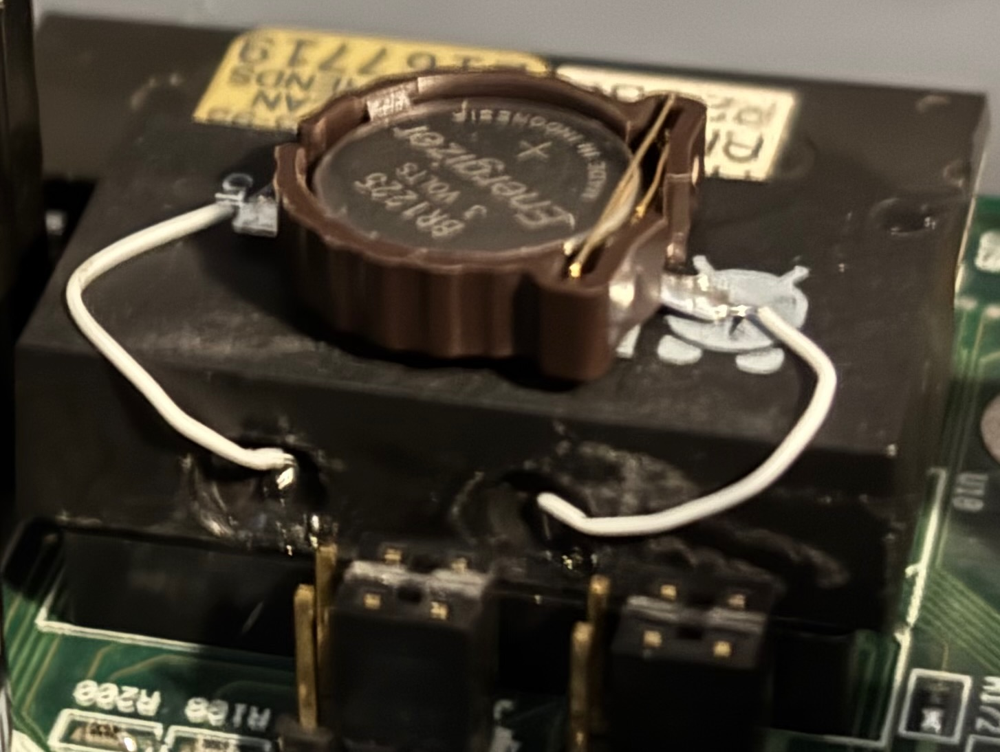

# AOpen AP5VM Socket 7 Motherboard

## Specifications

- Chipset: Intel 430VX (PCIset VX Triton II)
- CPU socket: Socket 7 (PGA321)
- Front-side bus speeds: 50, 55, 60, and 66 MHz
- Form factor: Baby AT, 250 × 220 mm
- Cache: 256KB or 512KB
- Memory: up to 128MB of 72-pin FPM/EDO or SDRAM/168-pin EDO UDIMM
- Expansion slots: 4× PCI and 3× 16-bit ISA
- I/O: AT keyboard, floppy, 2× IDE, PS/2 mouse, parallel, 2× serial, and 2× USB 1.x

## Documentation

- [AOpen AP5VM Motherboard Manual](AP5VM-manual.pdf) (from [The Retro Web](https://theretroweb.com/motherboard/manual/ap5vm-6886482279a4d281799365.pdf))
- [AOpen AP5VM-2 motherboard entry](https://theretroweb.com/motherboards/s/aopen-ap5vm-2) on The Retro Web

## Personal Notes

I bought this board in 2026 to restore the [Pentium-120 system](../../../computers/Pentium-120/README.md) as closely as possible to its original configuration.  I got a good deal on it because the RTC battery was dead and it wouldn't boot past the BIOS screen without it. 

### RTC Repair

I desoldered the RTC clock (successfully this time, using my Hakko FR301), originally intending to replace it with a [Necroware nw12887](https://github.com/necroware/nw12887) (covered in this [Necroware video](https://www.youtube.com/watch?v=ecTZtZhE9bI)). I bought an unassembled kit for it on eBay, but soldering the tiny RTC IC proved too challenging.  After lifting a solder pad on the PCB, I gave up and decided to repair the original RTC chip using the method described in this [Necroware video](https://www.youtube.com/watch?v=xBvw1TLHyqM) instead. I ground holes in the side of the original RTC to expose the battery contacts and connected the CR1225 holder from the kit to the contacts using 60 gauge wire. I cut a narrow 24-pin socket in half and soldered each side into the wide footprint of the original RTC chip, then inserted the modified chip back into the socket.

