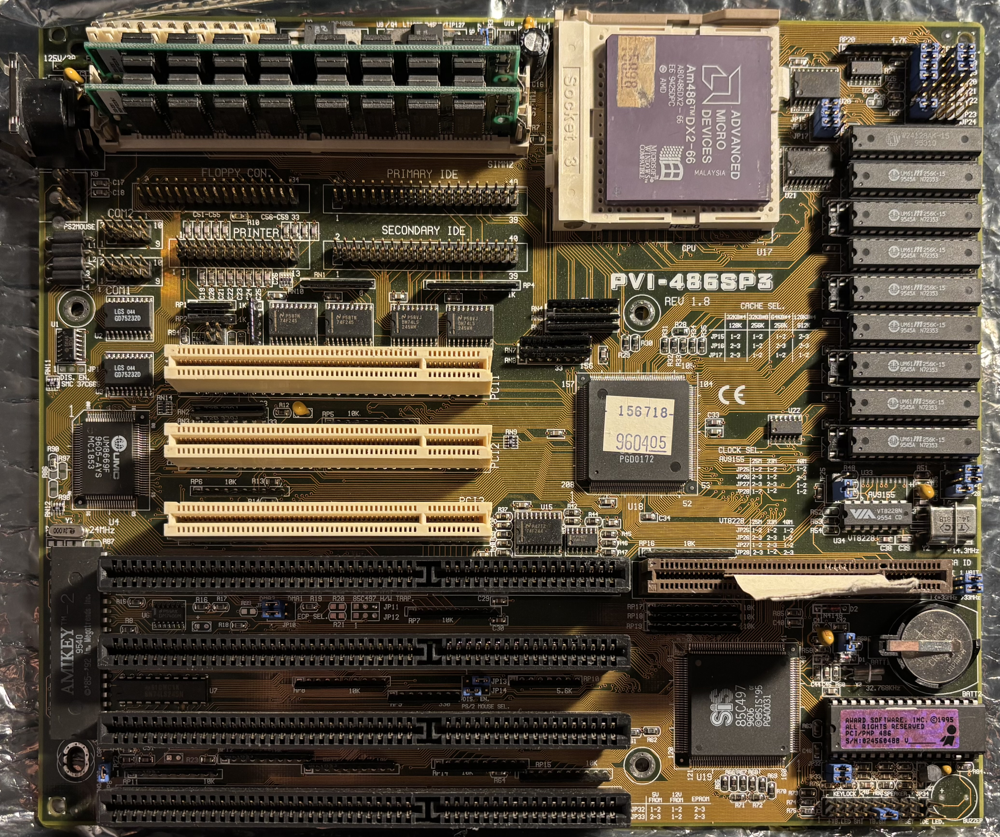

# Asus PVI-486SP3 Motherboard

The PVI-486SP3 is a Socket 3 486 motherboard with ISA, VLB, and PCI slots, and onboard IDE, floppy, serial, parallel, and PS/2 mouse ports.

## Specifications

- Chipset: SiS 85C496/497 (486-VIP VESA/ISA/PCI)
- CPU socket: Socket 3 (PGA237); supports Intel 486 DX/DX2 and 3.3V DX4 processors
- Front-side bus speeds: 25, 33, and 40 MHz
- Form factor: Baby AT, 254 × 218 mm
- Release year: 1994
- Cache: 128KB, 256KB, or 512KB
- Memory: up to 128MB of 72-pin FPM or EDO RAM
- Expansion slots: 4× 16-bit ISA, 3× PCI, and 1× VLB
- I/O: AT keyboard, floppy, 2× IDE, PS/2 mouse, parallel, and 2× serial

## Further Information

- [PVI-486SP3 Manual](manual.pdf)
- [Micro House Jumper Guide](jumpers.pdf)
- [Asus PVI-486SP3 motherboard entry](https://theretroweb.com/motherboards/s/asus-pvi-486sp3) on The Retro Web

## Personal Notes

I bought this motherboard from a friend in the [DFW Retro Computing](https://www.facebook.com/groups/350060128451803) Facebook group in February 2025 along with the [Am486DX2-66](../../cpu/AMD-Am486DX2-66/README.md) CPU installed in it.  The VLB slot is damaged but still works. When no VLB card is installed, a piece of cardboard must be inserted to prevent the contacts on either side from touching.

In 2026, the board started intermittently failing to POST when turbo was enabled. Thus far, I have not been able to get it working reliably again, so I removed it from the [case](../../../computers/Pentium-120/Case/README.md) now housing my [Pentium-120 system](../../../computers/Pentium-120/README.md).

### 486DX2-66 System

Before it was removed, this motherboard was part of the following system, put together in 2025:

- [AMD Am486DX2-66 CPU](../../cpu/AMD-Am486DX2-66/README.md)
- [16MB Memory (2x Micron 8MB FPM SIMMs)](../../memory/Micron-8MB-FPM/README.md)
- [Cirrus Logic CL-GD5429 VLB Video Card](../../video/CL-GD5429/README.md)
- [Sound Blaster 16 (CT2230) 16-bit Sound Card](../../sound/SoundBlaster-CT2230/README.md)
- [Serdaco DreamBlaster S2 Wavetable Daughterboard](../../sound/Serdaco-DreamBlaster-S2/README.md)
- [SMC EtherEZ 8416T 10Base-T Ethernet Adapter](../../network/SMC-8416T/README.md)
- [Bytecc BT-145 3.5" 1.44MB Floppy Drive](../../storage/Bytecc-BT-145/README.md)
- [Mitsumi CRMC-FX810T4 8x CD-ROM Drive](../../storage/Mitsumi-CRMC-FX810T4/README.md)
- [Syba IDE to CompactFlash Adapter](../../storage/Syba-IDE-CF-Adapter/README.md)
