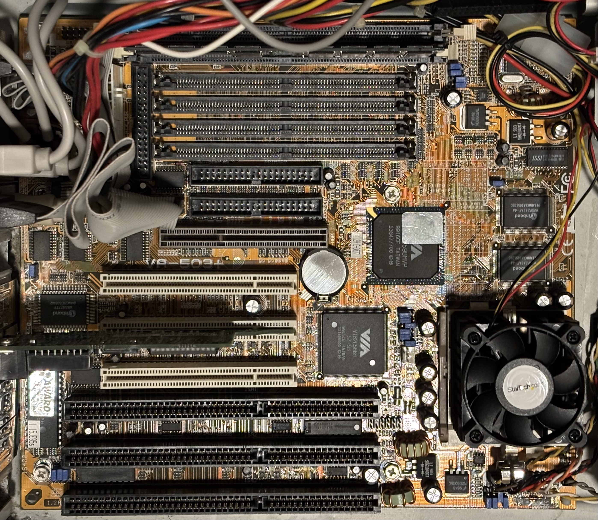

# FIC VA-503+ Super Socket 7 Motherboard

From the manual:

>Based on the new highly-integrated VIA APOLLO MVP3 Chipset, the VA-503+ combines blistering Pentium processor performance with support for switching voltage regulator which allows the voltage from 2.0V to 3.2V, intelligent diagnostic, and power management features. The new Accelerated Graphics Port (AGP) interface provides a dedicated path for memory-intensive graphics applications-delivering faster system performance and arcade-quality 2x mode 3D graphics. The VA-503+ has a versatile Baby AT-size platform for leading-edge PC ’97 compliant systems.

## Documentation

- [FIC VA-503+ Motherboard Manual](VA-503+.pdf) (from [The Retro Web](https://theretroweb.com/motherboards/s/fic-va-503#docs))
- [VIA VT82C596A Datasheet](VT82C596A.pdf)
- [VIA VT82C598MVP Datasheet](VT82C598MVP.pdf)
- [Winbond W83877TF Datasheet](W83877TF.pdf)

## Personal Notes

Mine was made in after the 16th week of 1999 (based on date codes on the chipset). It came with the [Juniper K6 system](../../../computers/Juniper-Valley-K6/README.md) it is installed in.

## Drivers

- [Via Chipset Drivers](https://www.philscomputerlab.com/via-chipset-drivers.html) (philscomputerlab.com) - download 4in1435v.zip

## Further Information
- [FIC VA-503+ on The Retro Web](https://theretroweb.com/motherboards/s/fic-va-503)
- [FIC Motherboards on DOS Days](https://www.dosdays.co.uk/topics/Manufacturers/fic.php)
- [FIC VA-503+ Review on Anandtech](https://www.anandtech.com/show/152)
- [FIC VA-503+ Review on Tom's Hardware](https://www.tomshardware.com/reviews/socket-7-board-review-july-1998,79-11.html)
