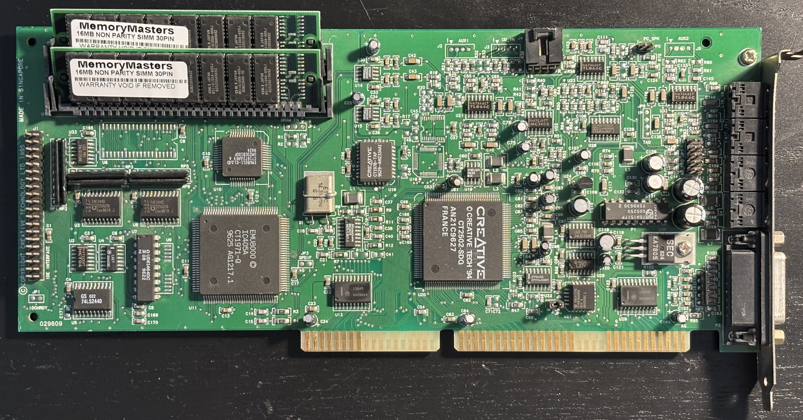
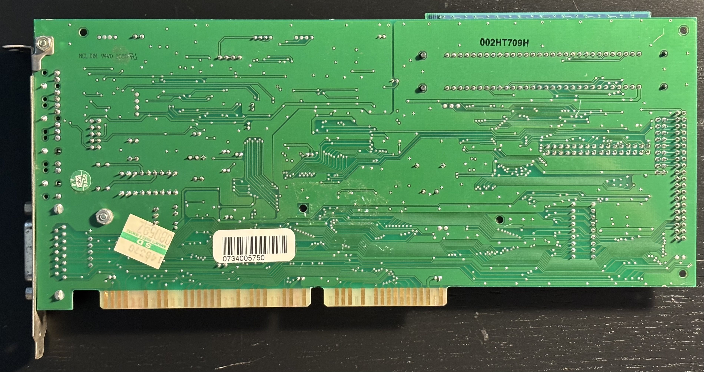

# Sound Blaster 32 PnP (CT3600) Sound Card

From [Sound Blaster 32](https://en.wikipedia.org/wiki/Sound_Blaster_AWE32#Sound_Blaster_32) entry on Wikipedia:

>The Sound Blaster 32 (SB32) was a value-oriented offering from Creative, announced on June 6, 1995, designed to fit below the AWE32 Value in the lineup. The SB32 lacked onboard RAM, the Wave Blaster header, and the CSP socket. The boards also used ViBRA integrated audio chips, which lacked adjustments for bass, treble, and gain (except ViBRA CT2502[1]). The SB32 had the same MIDI capabilities as the AWE32, and had the same 30-pin SIMM RAM expansion capability. The board was also fully compatible with the AWE32 option in software and used the same Windows drivers. Once the SB32 was outfitted with 30-pin SIMMs, its sampler section performed identically to the AWE32's. OPL-3 support varied among the models: the CT3930 came with a Yamaha YMF262 OPL-3 FM synthesis chip, whereas most models feature CQM synthesis either integrated into the ViBRA chip or via an external CT1978 chip. The majority of Sound Blaster 32 cards used TDA1517 amplifiers. Some Sound Blaster 32 PnP with onboard 512kB RAM was sold as AWE32 OEM in Dell computers.

## Documentation

- [Getting Started Guide for the Sound Blaster AWE32](CT3600-manual.pdf) 
- [MTL jumper manual for CT3600](CT3600-jumpers.pdf) from The Retro Web
- [Sound Blaster Series Hardware Programming Guide](sbhwpg.pdf) (from [PhatCode](https://www.phatcode.net/articles.php?id=243))
- [AWE32 Developer's Information Package](adip301.pdf) (from [PhatCode](https://www.phatcode.net/articles.php?id=244))
- [AWE32/EMU8000 Programmer’s Guide](emu8kpgm.pdf) (from [PhatCode](https://www.phatcode.net/articles.php?id=244))

## Personal Notes

My board was made in Singapore after the 29th week of 1996. I bought it in September 2024 from the [bytesand_sv](https://www.ebay.com/usr/bytesand_sv) eBay store.  I upgraded it with 32MB of RAM (2x16MB SIMMs), which I bought from the [MemoryMasters](https://www.ebay.com/str/memorymasters) eBay store in October 2024.

In high school circa 1994, I upgraded my Dell 486DX2-66's sound card to a non-PnP AWE32 (unsure of the exact model). I transplanted it to my two subsequent systems, a Pentium 120 and an AMD K6-300, finally giving it away (along with the K6 system containing it) when I upgraded to a Pentium 4 after I graduated college.

## Drivers

I have found these to be the best source for drivers:

- [Sound Blaster AWE32 Install CD](https://www.vogonsdrivers.com/getfile.php?fileid=311&menustate=0) on vogonsdrivers.com: contains the full set of drivers and software for both Windows 95/98 and Windows 3.1/DOS as well as Sample MIDI and WAV files.
- [Sound Blaster AWE32 Drivers](https://www.philscomputerlab.com/sound-blaster-awe-32.html) on philscomputerlab.com: updated drivers from Creative's BBS and Support Site, but they don't include the full set of applications on the Install CD.

Normally, I install the Install CD first, then update my drivers with sbw9xup.exe (Windows 9x) or sbbasic.exe (DOS/Windows 3.1).

## Further Information

- [Sound Blaster 32](https://support.creative.com/Products/ProductDetails.aspx?prodID=1844&prodName=Sound%20Blaster%2032) on Creative Support Site
- [Sound Blaster 32, AWE32 and AWE64](https://dosdays.co.uk/topics/Manufacturers/sb_awe32_64.php) on DOS Days
- [Sound Blaster 32 IDE PNP (CT3600)](https://theretroweb.com/expansioncards/s/creative-sound-blaster-32-ide-pnp-ct3600) on The Retro Web