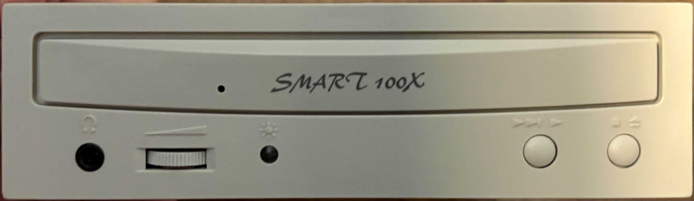
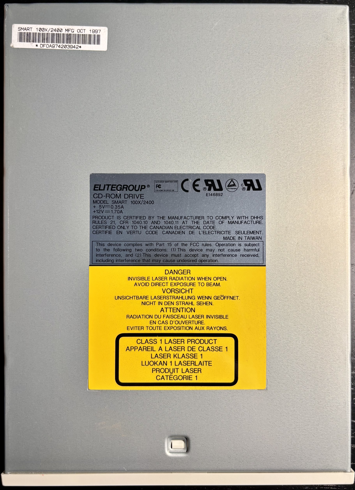

# Elitegroup Smart 100X/2400 24X CD-ROM Drive

This drive is actually a 24X CD-ROM drive with caching software that its marketing claims makes it equivalent of a 100X drive.

## Personal Notes

This drive was made in Taiwan in October 1997. It came in a kit along with a Yamaha Audician 32 sound card that I found new in box at Computer Reset.