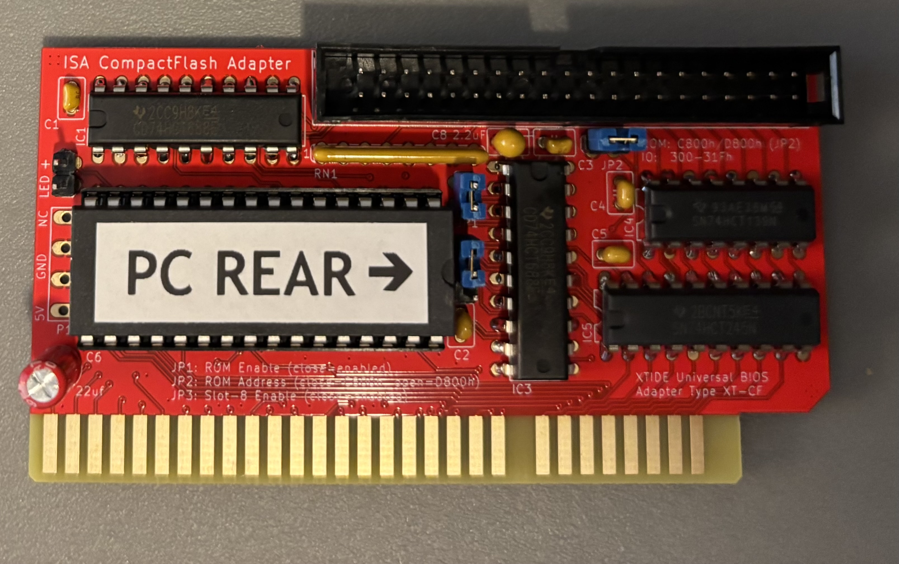
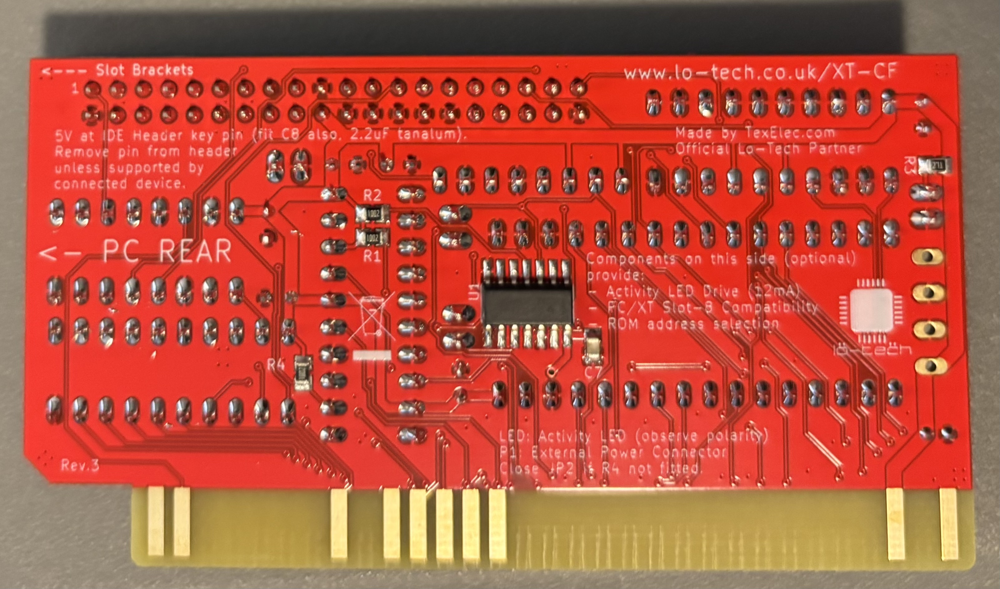

# Lo-tech XT-CF 8-bit IDE interface

From the [Lo-tech XT-CF Boards](https://www.lo-tech.co.uk/wiki/Lo-tech_XT-CF_Boards) wiki page:

>The Lo-tech ISA CompactFlash Adapter revision 2b is a bootable storage adapter for IBM PC, PC/XT, PC/AT and compatible hardware - essentially any PC with an ISA slot. The card enables the use of:
>- Standard CompactFlash cards, via any low-cost CompactFlash to IDE adapter
>- SD-Cards, via an FC1306T based SD to IDE adapter
>- ATA-2 compliant hard disks
>
>...
>The board is programmatically identical to the XT-CF-lite and uses the XT-IDE Universal BIOS, provided through an in-system re-programmable 32KB flash-based ROM. Since the BIOS is only 8KB, 24KB is available for other purposes, and is byte-programmable - the board can therefore function as a universal ROM board.

Mine was purchased in January 2025 from [TexElec](https://texelec.com/product/isa-compactflash-adapter/).

## Documentation
- [Lo-tech XT-CF Boards](https://www.lo-tech.co.uk/wiki/Lo-tech_XT-CF_Boards) wiki page
- [XT-IDE Universal BIOS](https://xtideuniversalbios.org) wiki page
