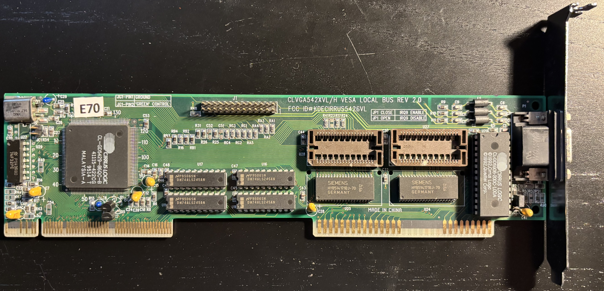
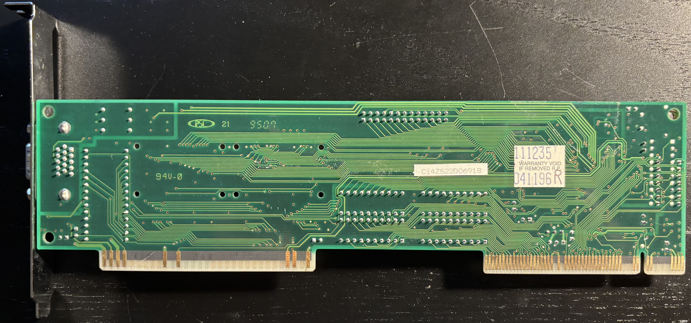

# Cirrus Logic CL-GD5429 VLB Video Card

From [DOS Days](https://dosdays.co.uk/topics/Manufacturers/cirruslogic/clgd5429.php):

>The CL-GD5429 was an enhanced version of the CL-GD5428 that first appeared in the first quarter of 
>1995 - the first in their new "Alpine" series of chips. 
>
>What is new over prior GD-542x chipsets is the 5429/30 now support a higher memory clock speed (32-bit 
>memory bus) and has memory-mapped I/O. They also have a 32-bit BitBLT engine.

My board was made in China on April 11, 1996. 

## Documentation

- [CL-GD542x Technical Reference Manual](CL-GD542x.pdf)

## Personal Notes

I bought this card from [Vintage Electronic Store](https://www.ebay.com/str/vintageelectronicstore) on eBay in January 2025.  I never had a VLB-based system or graphics card when they were new, so I wanted one in my collection.  The Dell 486 system I had in 1993 had an S3 805 video chip directly on its motherboard that was connected to the CPU's local bus, but had no VLB slots.

## Drivers

- [Cirrus Logic GD542x Windows 3.1 Drivers v1.43](https://vogonsdrivers.com/getfile.php?fileid=923&menustate=0) on vogonsdrivers.com

## Further Information

- [QDI CLVGA542XVL/H VLB REV. 2.0 (5429)](https://theretroweb.com/expansioncards/s/qdi-clvga542xvl-h-vlb-rev-2-0-5429) on The Retro Web
- [Cirrus Logic CL-GD5429 / CL-GD5430](http://dosdays.co.uk/topics/Manufacturers/cirruslogic/clgd5429.php) on DOS Days