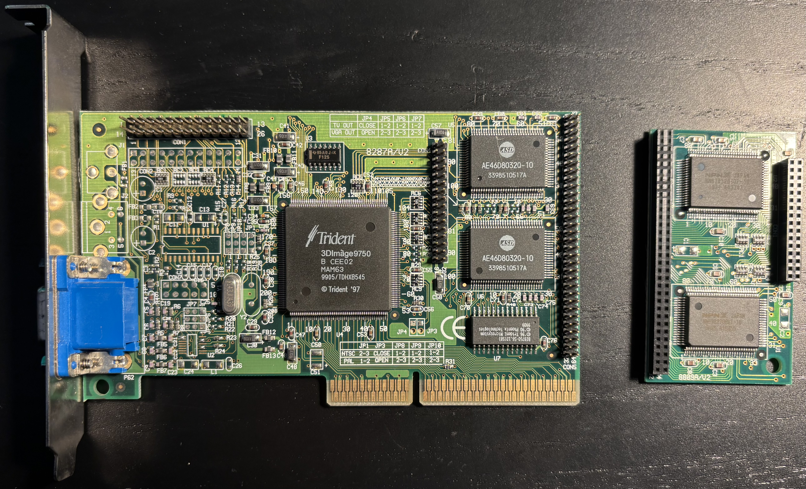
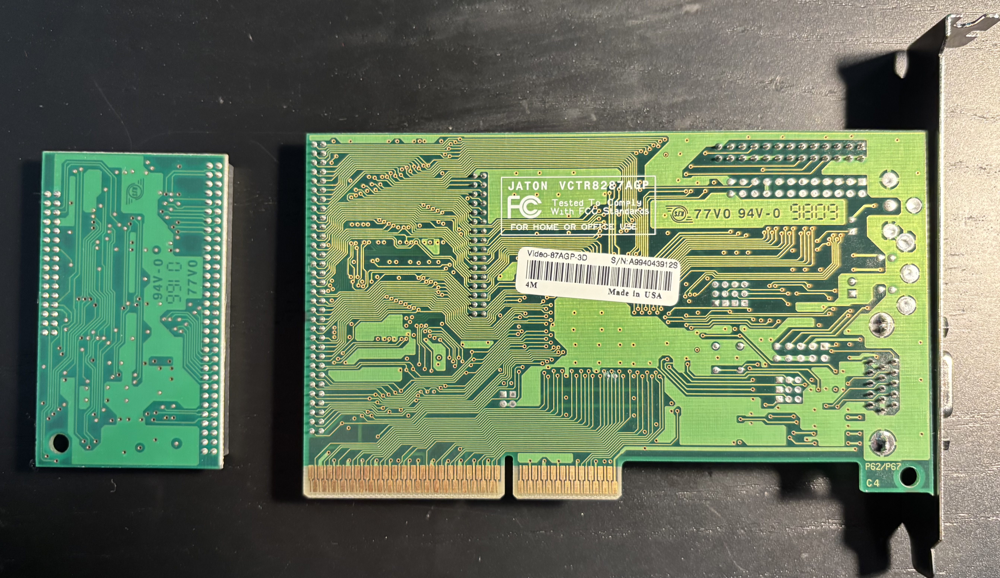

# Jaton Trident 3DImage 9750 AGP Video Card

## Documentation

- [3DImage9750 Product Brief](3DImage9750.pdf)

## Personal Notes

My board was made in the 5th week of 1999 in the USA. It came pre-installed in my [Juniper Valley K6](../../../computers/Juniper-Valley-K6/README.md).  I took it out as soon as I got my [Voodoo3](../3dfx-Voodoo3-3000/README.md). It's [not great](https://vintage3d.org/trident.php).
